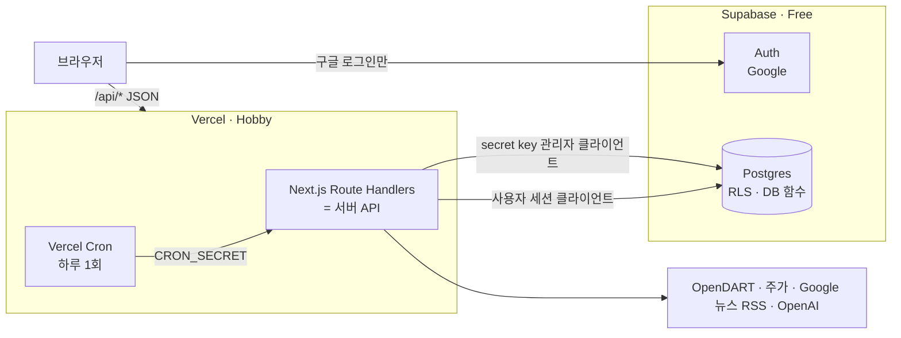
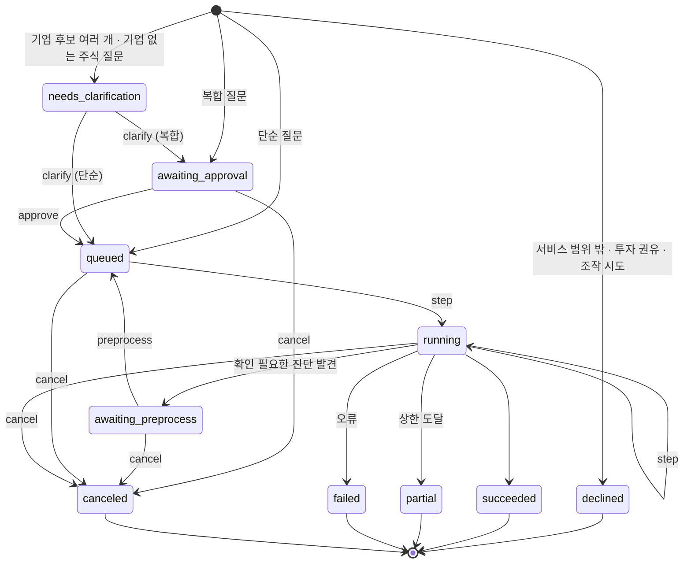
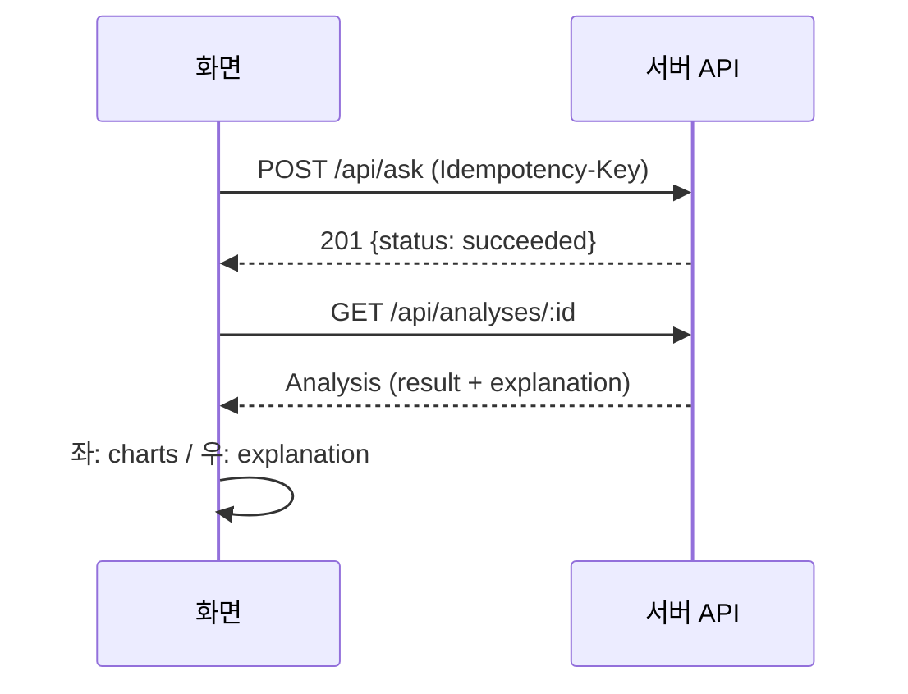
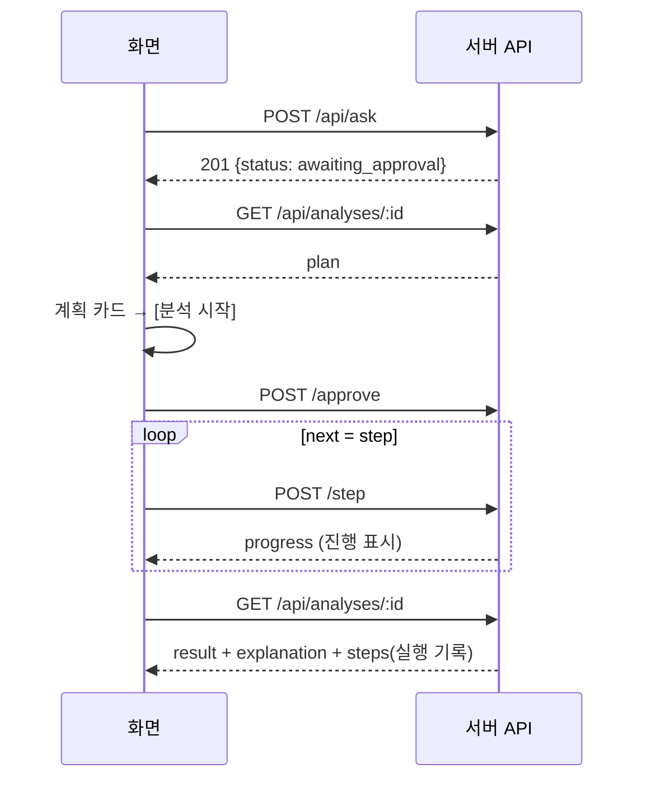

# API_SPEC — 서버 API 명세 (Supabase + Vercel)

| 항목 | 내용 |
|---|---|
| 프로젝트 | project_sleepyheads |
| 문서 종류 | API_SPEC (서버 API 명세) |
| 작성자 | Sung, Hyun-Joon · Lee, Yelim · ByeongJun Min |
| 작성일 | 2026-09-28 |
| 버전 | v0.3.5 |
| 기준 문서 | [PRD](./PRD.md) v0.6 · [TECH_SPEC](./TECH_SPEC.md) v0.6 |
| 문서 관리 | 통합/배포 (계약 타입 §2는 데이터/서버 + 기획/화면 공동) |

### 변경 이력
| 버전 | 날짜 | 내용 |
|---|---|---|
| v0.1 | 2026-09-28 | 초안: 백엔드 구성, 공통 규칙, 계약 타입, 엔드포인트 23개, 상태 전이, Supabase·Vercel 설정 |
| v0.2 | 2026-09-29 | 서비스 범위 밖 질문 거절: 분석 상태 `declined`, `Decline` 타입, Q1 응답·질문 차감 규칙, `DECLINE_LIMIT` 오류, 상태 전이 추가 |
| v0.2.1 | 2026-09-29 | Auth 설정(§7.5)에 Google OAuth 앱 "프로덕션" 게시 항목 추가 |
| v0.2.2 | 2026-09-29 | 서버 API 뼈대 반영: 오류 코드 `INTERNAL_ERROR`(500)·`NOT_IMPLEMENTED`(501) 추가(§1.7), A2 로그아웃을 약관 동의 전에도 허용(🔑*) |
| v0.3 | 2026-09-29 | **분석 글에 투자 포인트 `insights` 추가**(§2.6, 필드 추가만 — 기존 필드 그대로), 분량 상한 `EXPLANATION_LIMITS`. 뉴스 출처를 Google 뉴스 RSS로 교체해 환경변수 `NAVER_CLIENT_ID`·`NAVER_CLIENT_SECRET` 삭제(§8.3), 개발 전용 `NEXT_PUBLIC_API_MOCK` 추가(§8.3) |
| v0.3.1 | 2026-09-29 | WU-108 구글 로그인 반영: A1 실패 시 `/login?error=callback&next=…`로 이동·이동은 `303`, 회원 정보(`profiles`)는 첫 로그인 때 서버가 만든다, Auth 설정(§7.5) Site URL·Redirect URL(`/**` 와일드카드)·구글 클라우드 승인된 리디렉션 URI 확정 |
| v0.3.2 | 2026-09-29 | Q4 `step` 최대 실행 시간 60초 → 300초 (운영 첫 질문이 시간 초과로 실패, §8.2) |
| v0.3.3 | 2026-09-30 | WU-114 질문 수 한도: 요청 속도 제한을 DB 함수 `check_request_rate`로(§1.6·§7.3, 한도 값은 `quota_config`), 같은 멱등키 동시 요청 1회만 차감(`quota_consumptions`, `consume_quota.already_consumed`, Q1 처리 중이면 409), A5 `serviceStatus` 판정 기준(§4) |
| v0.3.4 | 2026-09-30 | WU-115 비로그인 예시: G1 응답 타입 `GuestExample`·예시가 아직 없으면 `404`, C2 `?force=1`(관리자 수동 재생성)·새 보고서 판정(정기공시 목록 1회)·최대 실행 시간 120초 → 300초 |
| v0.3.5 | 2026-09-30 | PR #19 리뷰 후속: `/auth/callback`(A1)은 분당 요청 제한에서 제외(§1.6), Q1 같은 멱등키 재요청은 차감 뒤 2분이 지나도 분석이 없으면 409 대신 다시 처리 |

> 화면(브라우저)과 서버가 주고받는 모든 약속을 이 문서 하나에 모았다. **API를 바꿀 때는 이 문서를 먼저 고치고** PR에서 관련 역할의 확인을 받는다 (HANDOFF §5).

---

## 0. 백엔드 구성



| 구성 요소 | 맡는 일 |
|---|---|
| **Vercel — Route Handlers** | 모든 서버 API (`src/app/api/**/route.ts`). 외부 API 호출·계산·AI 호출은 여기서만 |
| **Vercel — Cron** | 매일 1회 기업 목록 동기화, 비로그인 예시 갱신 |
| **Supabase — Auth** | 구글 로그인, 세션 쿠키 발급 |
| **Supabase — Postgres** | 모든 저장 데이터, RLS(행 단위 접근 제어), 한도 차감 등 DB 함수 |

**원칙**
1. 브라우저는 **Supabase DB를 직접 조회하지 않는다.** 브라우저에서 Supabase를 쓰는 곳은 로그인·로그아웃뿐이다. 모든 데이터는 `/api/*`를 거친다.
2. RLS는 **두 번째 방어선**이다. 서버가 소유자를 먼저 확인하고, 실수로 빠져도 RLS가 막는다.
3. 외부 API 키와 Supabase secret key는 **Vercel 서버 환경변수에만** 있다.

---

## 1. 공통 규칙

### 1.1 주소
| 환경 | 주소 | Supabase 프로젝트 |
|---|---|---|
| 로컬 | `http://localhost:3000` | `sleepyheads-dev` |
| Preview (PR마다) | `https://<자동 생성>.vercel.app` | `sleepyheads-dev` |
| Production | `https://<프로젝트명>.vercel.app` (WU-003에서 확정) | `sleepyheads-prod` |

### 1.2 인증
- 로그인 세션은 Supabase Auth가 **쿠키**로 관리한다 (`@supabase/ssr`). 브라우저는 따로 토큰을 붙이지 않는다.
- 서버는 요청마다 쿠키의 세션을 **Supabase에 검증**(`getUser()` 또는 `getClaims()`)한 뒤 사용자 ID를 얻는다. 쿠키 값만 읽고 믿지 않는다.
- 약관 미동의 사용자는 🔑 API에서 `403 TERMS_REQUIRED`.

### 1.3 권한 표기
| 표기 | 뜻 |
|---|---|
| 🔓 | 누구나 (비로그인 포함) |
| 🔑 | 로그인 + 약관 동의 |
| 🛡️ | 🔑 + **리소스 소유자** (아니면 `404 NOT_FOUND` — 존재 여부도 알려주지 않음) |
| ⚙️ | 시스템 전용 (`Authorization: Bearer <CRON_SECRET>`) |

### 1.4 요청·응답 형식
| 항목 | 규칙 |
|---|---|
| 형식 | JSON, UTF-8. 필드 이름은 **camelCase** |
| 성공 응답 | `{ "data": ... }` (목록은 `{ "data": [...], "nextCursor": "..." }`) |
| 오류 응답 | `{ "error": { "code": "...", "message": "...", "details": {...}, "resetAt": "..." } }` |
| 시각 | ISO 8601, 한국 시간 (`2026-09-28T14:30:00+09:00`) |
| 날짜 | `YYYY-MM-DD` |
| 분기 | 달력 분기 `YYYYQn` (예: `2026Q2`) |
| 금액 | **원 단위 정수** (화면에서 억·조 원으로 변환) |
| 비율 | 퍼센트 숫자 (`12.3` = 12.3%) |
| ID | UUID 문자열 |
| 계산 불가 값 | `null` + 옆 필드 `reason`(`NO_PREV_PERIOD`, `ZERO_DENOMINATOR`, `MISSING_ACCOUNT`, `NO_PRICE`, `DEFICIT`, `CAPITAL_IMPAIRMENT`) |

### 1.5 공통 헤더
| 헤더 | 방향 | 내용 |
|---|---|---|
| `Idempotency-Key` | 요청 | `POST /api/ask`, `/rewrite`, `/rerun`에 **필수**. 브라우저가 UUID를 만들어 보냄. 같은 키로 다시 보내면 첫 결과를 그대로 돌려줌 (중복 처리 방지) |
| `X-Request-Id` | 응답 | 요청 추적용 ID (오류 문의 시 사용) |
| `X-Questions-Remaining` | 응답 | 오늘 남은 질문 수 (🔑 API 응답마다) |
| `Retry-After` | 응답 | 429일 때 다시 시도할 수 있는 초 |

### 1.6 요청 속도 제한
| 구분 | 한도 | 대상 |
|---|---|---|
| 질문 관련 요청 | 회원당 **분당 10회** | `ask`, `clarify`, `rewrite`, `rerun` |
| 전체 요청 | 회원당 **분당 120회** | 모든 🔑 API (분석 진행 상태 확인·단계 실행 포함) |
| 비로그인 | IP당 분당 30회 | 🔓 API (`/auth/callback` 제외 — 구글이 준 일회용 코드가 있어야만 로그인되고, 같은 IP로 여러 명이 동시에 로그인하는 수업 시연에서 막히면 안 된다) |

- 1분 고정 창으로 DB에서 센다 (DB 함수 `check_request_rate`, §7.3). 한도 값은 `quota_config`의 `question_requests_per_minute`·`requests_per_minute`·`guest_requests_per_minute`라 코드 수정 없이 바꿀 수 있다.
- DB 오류로 셀 수 없으면 제한 없이 통과시키고 서버 로그에 경고를 남긴다 (남용 방지 장치가 서비스 전체를 멈추지 않게). 질문 수 한도(`consume_quota`)는 따로 지킨다.

### 1.7 오류 코드
| code | HTTP | 뜻 | 화면 처리 |
|---|---|---|---|
| `VALIDATION_ERROR` | 400 | 요청 형식 오류 (필드 누락·형식 틀림) | 입력 확인 안내 |
| `UNAUTHORIZED` | 401 | 로그인 필요 | 로그인 페이지로 |
| `TERMS_REQUIRED` | 403 | 약관 동의 필요 | `/onboarding`으로 |
| `NOT_FOUND` | 404 | 없음 또는 소유자 아님 | "찾을 수 없음" |
| `INVALID_STATE` | 409 | 지금 상태에서 할 수 없는 동작 (예: 취소된 분석에 승인) | 새로고침 안내 |
| `TOO_LARGE` | 413 | 처리 한도 초과 (TECH §12.5) | 기간·기업 줄이기 안내 |
| `UNSUPPORTED_QUESTION` | 422 | 지원하지 않는 지표·연산·질문 | 가능한 질문 예시 |
| `OUT_OF_RANGE` | 422 | 조회 가능 기간(2015Q1~) 밖 | 가능 범위 안내 |
| `QUOTA_EXCEEDED` | 429 | 오늘 질문 수 소진 | `resetAt` 표시 |
| `DECLINE_LIMIT` | 429 | 오늘 서비스 범위 밖 질문 거절이 10회를 넘음 | "서비스 목적에 맞는 질문만 가능합니다" + `resetAt` |
| `RATE_LIMITED` | 429 | 분당 요청 초과 | `Retry-After`초 후 재시도 |
| `UPSTREAM_ERROR` | 502 | 외부 API(OpenDART 등) 오류 | 잠시 후 재시도 |
| `SERVICE_BUDGET` | 503 | 서비스 전체 한도 도달 | 내일 이용 안내 |
| `LLM_UNAVAILABLE` | 503 | AI 장애 | **가짜 결과 없이** 실패 안내 |
| `INTERNAL_ERROR` | 500 | 예상하지 못한 서버 오류 (내용은 응답에 넣지 않고 `X-Request-Id`로 서버 로그에 남김) | "잠시 후 다시 시도" + 요청 ID 안내 |
| `NOT_IMPLEMENTED` | 501 | 아직 구현되지 않은 API (개발 중에만. 메시지에 담당 WU 표시) | 화면에서 쓰지 않음 |

- 질문당 상한 도달(`STEP_LIMIT`, `TIMEOUT`, `COST_LIMIT`)은 HTTP 오류가 아니라 분석의 `status: "partial" | "failed"`와 `stopReason`으로 알린다 (§2.3).

### 1.8 목록 페이지 나누기
- `?limit=20&cursor=<이전 응답의 nextCursor>` (기본 20, 최대 50). 최신순.

---

## 2. 계약 타입 (`src/contracts/`)

> 아래 타입은 `src/contracts/*.ts`에 그대로 옮기고, 서버는 Zod 스키마로 검증한다. **바꿀 때는 데이터/서버 + 기획/화면 모두의 확인 필요.**
> AI 내부 형식(TECH §4.2, snake_case)은 서버 안에서만 쓰고, API로는 아래 camelCase 형식만 나간다.

### 2.1 기본 타입
```ts
type UUID = string;
type Quarter = `${number}Q${1 | 2 | 3 | 4}`;           // "2026Q2"
type Unit = "KRW" | "PERCENT" | "TIMES" | "COUNT";      // 원, %, 배, 건
type NullReason =
  | "NO_PREV_PERIOD" | "ZERO_DENOMINATOR" | "MISSING_ACCOUNT"
  | "NO_PRICE" | "DEFICIT" | "CAPITAL_IMPAIRMENT";

interface CompanyRef {
  corpCode: string;        // OpenDART 고유번호 8자리
  stockCode: string;       // 종목코드 6자리
  name: string;            // "SK하이닉스"
  market: "KOSPI" | "KOSDAQ";
  sector: { name: string; source: "manual" | "induty_code" | "other"; isFinancial: boolean };
  fiscalMonth: number;     // 결산월 (12 = 12월 결산)
}

interface PeriodRange {
  from: Quarter;
  to: Quarter;
  specified: boolean;      // 질문에 기간이 있었는가
  reason: string;          // "기간 미지정 → 최근 4개 분기"
  clipped: boolean;        // 조회 가능 범위로 잘렸는가
}
```

### 2.2 분석 요청 (서버가 해석·검사한 결과를 화면에 보여줄 때)
```ts
type Intent = "recent" | "trend" | "annual" | "cause" | "compare" | "event";
type MetricId =
  | "revenue" | "operating_income" | "net_income" | "operating_margin" | "net_margin"
  | "yoy" | "qoq" | "ttm_owners_ni" | "roe" | "debt_ratio" | "equity_ratio"
  | "market_cap" | "per" | "pbr";

interface AnalysisRequestView {
  intent: Intent;
  target: CompanyRef;
  peers: CompanyRef[];               // 비교 기업 (최대 5)
  metrics: MetricId[];
  period: PeriodRange;
  groupBy: "quarter" | "year" | "company" | "sector";
  needsNews: boolean;
}
```

### 2.3 분석 상태
```ts
type AnalysisStatus =
  | "declined"              // 서비스 범위 밖으로 거절 (끝난 상태)
  | "needs_clarification"   // 되묻기 대기
  | "awaiting_approval"     // 복합 질문 계획 승인 대기
  | "awaiting_preprocess"   // 전처리 확인 대기 (Step 2)
  | "queued"                // 실행 대기 (단계 실행 요청을 기다림)
  | "running"
  | "succeeded"
  | "partial"               // 상한 도달로 일부만 완료
  | "failed"
  | "canceled";

type StopReason = "STEP_LIMIT" | "TIMEOUT" | "COST_LIMIT" | "UPSTREAM_ERROR" | "LLM_UNAVAILABLE" | "USER_CANCELED";

// 서비스 범위 밖 거절 (TECH §4.11)
type DeclineCategory = "out_of_scope" | "advice_request";   // 조작 시도는 화면에 out_of_scope로만 보임
interface Decline {
  category: DeclineCategory;
  message: string;            // 서버 고정 문구 (PRD §6.3.1) — AI가 만든 글이 아님
  suggestions: string[];      // 대신 해볼 수 있는 질문 예시 1~3개
  questionCharged: true;      // 거절도 질문 1회 차감
}
```
- `manipulation`(AI 조작 시도)은 서버 내부 기록에만 남고, API 응답에서는 `out_of_scope`로 내보낸다 (탐지 사실을 드러내지 않음).
- 범위 안 질문에 범위 밖 요청이 섞였으면 `declined`가 아니라 정상 분석이며, `Explanation.caveats` 끝에 "섞인 질문" 안내 문구가 붙는다.

### 2.4 되묻기·계획·실행 기록
```ts
interface Clarification {
  question: string;                            // "어느 회사를 말씀하신 건가요?"
  options: { id: string; label: string; company?: CompanyRef }[];
}

interface Plan {
  steps: { seq: number; tool: string; label: string }[];   // "② 분기별 영업이익 집계"
  estimatedExternalCalls: number;
  estimatedSeconds: number;
}

interface StepRecord {
  seq: number;
  tool: string;                    // "get_financials"
  inputSummary: string;            // "SK하이닉스, 영업이익, 2025Q3~2026Q2"
  outputSummary: string | null;    // "4개 분기, 연결 기준, 외부 호출 1건"
  status: "pending" | "running" | "succeeded" | "failed" | "skipped";
  retries: number;
  durationMs: number | null;
  errorReason: string | null;      // "직전 분기 데이터 없음 — QoQ 계산 불가"
}

interface Progress {
  current: number;                 // 완료한 단계 수
  total: number;
  label: string;                   // "3/5단계 — 분기 집계 중"
}
```

### 2.5 결과 객체 (좌측 차트 영역) — **기획/화면이 가장 많이 쓰는 타입**
```ts
interface Figure {                 // 화면의 모든 숫자
  id: string;                      // "f3" — 분석 글의 {{f3}}와 연결
  label: string;                   // "영업이익 QoQ"
  value: number | null;
  unit: Unit;
  display: string;                 // "+12.3%" / "5조 4,210억 원" (서버가 포맷)
  reason?: NullReason;             // value가 null일 때
  basis: { report: string; fsDiv: "CFS" | "OFS"; priceDate?: string };  // "2026 반기보고서"
}

interface Series {
  key: string;                     // "operating_income"
  label: string;                   // "영업이익"
  unit: Unit;
  points: { x: string; figureId: string }[];   // x = "2026Q2" 또는 기업명
  footnoteMark?: "※";              // 금융사 부채비율 등
}

interface Chart {
  id: string;                      // "c1" — 분석 글의 chartRef와 연결
  type: "card" | "bar" | "line" | "table";
  title: string;                   // "SK하이닉스 분기별 영업이익 (2025Q3~2026Q2)"
  xAxisLabel?: string;
  yAxisLabel?: string;             // "억 원"
  series: Series[];
  footnotes: string[];             // TECH §7 금융사 주석 문구 등
  source: string;                  // "출처: DART 2026 반기보고서 외 3건"
  // 표로 보기: series + figures로 화면이 표를 만든다 (차트와 같은 데이터)
}

interface Disclosure {
  rceptNo: string;
  title: string;
  date: string;
  tag: string;                     // "자금조달"
  importance: "high" | "mid";
  isCorrection: boolean;
  url: string;                     // DART 원문
}

interface UsedData {               // "사용된 데이터" 미리보기
  rows: number;
  columns: { name: string; type: "quarter" | "date" | "krw" | "percent" | "times" | "text" }[];
  period: PeriodRange;
  preview: Record<string, string | number | null>[];   // 앞 10행
  notes: string[];                 // "3월 결산 — 달력 분기로 환산", "별도 기준"
}

interface DataBasis {              // 분석 기준 바
  target: CompanyRef;
  period: PeriodRange;
  reports: string[];               // ["2026 반기보고서", "2026 1분기보고서", ...]
  priceDate: string | null;
  calcVersion: string;             // "v1"
  dataVersionId: UUID;
  newerDataVersionAvailable: boolean;
  flags: string[];                 // "금융업 포함 — 공통 지표로 변환", "기준 분기 다름"
}

interface ResultObject {
  basis: DataBasis;
  figures: Record<string, Figure>; // id → Figure
  charts: Chart[];
  disclosures: Disclosure[];
  usedData: UsedData;
}
```

### 2.6 분석 글 (우측 영역)
```ts
interface NewsClue {
  newsId: string;
  title: string;
  press: string;
  publishedAt: string;
  url: string;                     // Google 뉴스 RSS가 준 주소만 (Google 경유, 누르면 원문으로 이동)
  gist: string;                    // 우리가 만든 1~2문장 요지 (본문 아님)
}

// 투자 포인트 (PRD F-V6, F-V11~F-V13, TECH §11.3) — 숫자 해설이 아니라 투자 판단에 참고할 해석
type InsightKind = "positive" | "risk" | "watch";   // 긍정 요인 / 위험 요인 / 다음에 확인할 점
interface Insight {
  kind: InsightKind;
  text: string;                    // 서버가 숫자를 채운 완성 문장 (80자 이내)
  figureIds: string[];             // 근거 숫자 ID — figureIds·newsIds 중 하나 이상 필수
  newsIds: string[];               // 근거 뉴스 ID (Step 3부터)
  chartRef: string | null;         // 근거 차트 ("해당 차트 보기")
  inferred: boolean;               // 추정이 들어간 문장 → 화면에 "추정" 표시
}

// 분량 상한 — 스마트폰(너비 375px) 한 화면 (PRD F-V11). 서버 검사와 화면 테스트가 같은 값을 쓴다
const EXPLANATION_LIMITS = {
  conclusionSentences: 2,
  insightsMin: 2,
  insightsMax: 4,
  insightMaxChars: 80,
  mainMaxChars: 320,               // 결론 + 투자 포인트 합계 (공백 포함)
};

interface Explanation {
  status: "ready" | "failed" | "stale";   // stale = 필터 변경으로 원래 조건 기준
  conclusion: string[];            // 서버가 {{f3}}을 실제 값으로 채운 완성 문장 (2문장)
  insights: Insight[];             // 투자 포인트 2~4개 (근거 연결 검사를 통과한 것만)
  evidence: { text: string; chartRef: string | null }[];
  newsClues: NewsClue[];
  caveats: string[];
  label: "AI 작성";
  failureMessage?: string;         // status = failed일 때 "설명 생성 실패"
}
```

### 2.7 전처리·보드·사용량
```ts
interface Diagnosis {
  id: string;
  kind: "missing_account" | "duplicate_correction" | "mixed_fs_div" | "fiscal_month" | "boundary_mismatch";
  needsConfirmation: boolean;
  description: string;             // "2025Q4 영업이익 값 없음"
  affectedRows: number;
  options: { id: string; label: string; isDefault: boolean;
             preview: { rowsBefore: number; rowsAfter: number; sumBefore?: number; sumAfter?: number } }[];
}

interface BoardFilters {
  period?: { from: Quarter; to: Quarter };
  peers?: string[];                // stockCode 목록 (최대 5)
}

interface Usage {
  questionsUsed: number;
  questionsLimit: number;
  resetAt: string;                 // 다음 한국 시간 00:00
  serviceStatus: "ok" | "degraded" | "budget_reached";
}
```

### 2.8 분석 전체 (GET 응답)
```ts
interface Analysis {
  id: UUID;
  projectId: UUID;
  question: string;
  status: AnalysisStatus;
  stopReason: StopReason | null;
  decline: Decline | null;                 // status = declined일 때만
  request: AnalysisRequestView | null;     // 해석 전·실패·거절 시 null
  clarification: Clarification | null;
  plan: Plan | null;
  diagnoses: Diagnosis[];
  progress: Progress | null;
  steps: StepRecord[];
  result: ResultObject | null;
  explanation: Explanation | null;
  boardId: UUID | null;
  createdAt: string;
  updatedAt: string;
}
```

---

## 3. 엔드포인트 목록

| # | 메서드·경로 | 권한 | 설명 | 질문 차감 | Step |
|---|---|---|---|---|---|
| A1 | `GET /auth/callback` | 🔓 | 구글 로그인 후 돌아오는 주소 (세션 생성) | — | 1 |
| A2 | `POST /auth/signout` | 🔑* | 로그아웃 (*약관 미동의도 허용) | — | 1 |
| A3 | `GET /api/me` | 🔑* | 내 정보·약관 동의 여부 (*약관 미동의도 허용) | — | 1 |
| A4 | `POST /api/me/terms` | 🔑* | 약관 동의 (*약관 미동의 상태에서 호출) | — | 1 |
| A5 | `GET /api/me/usage` | 🔑 | 오늘 남은 질문 수 | — | 1 |
| A6 | `DELETE /api/me` | 🔑 | 회원 탈퇴 (개인 데이터 삭제) | — | 2 |
| S1 | `GET /api/search` | 🔑 | 기업 자동완성 | — | 1 |
| Q1 | `POST /api/ask` | 🔑 | 질문 제출 (새 프로젝트 또는 후속 질문) | **1** | 1 |
| Q2 | `GET /api/analyses/:id` | 🛡️ | 분석 상태·결과 전체 | — | 1 |
| Q3 | `POST /api/analyses/:id/clarify` | 🛡️ | 되묻기에 답하기 | — | 1 |
| Q4 | `POST /api/analyses/:id/step` | 🛡️ | 다음 단계 실행 | — | 1 |
| Q5 | `POST /api/analyses/:id/preprocess` | 🛡️ | 전처리 방식 확정 | — | 2 |
| Q6 | `POST /api/analyses/:id/rerun` | 🛡️ | 같은 조건 재실행 / 최신 데이터로 재분석 | 0 / **1** | 2 |
| Q7 | `POST /api/analyses/:id/approve` | 🛡️ | 분석 계획 승인 | — | 3 |
| Q8 | `POST /api/analyses/:id/cancel` | 🛡️ | 분석 취소 | — | 3 |
| Q9 | `POST /api/analyses/:id/rewrite` | 🛡️ | 설명 다시 쓰기 (현재 필터 기준) | **1** | 4 |
| P1 | `GET /api/projects` | 🔑 | 내 프로젝트 목록 | — | 2 |
| P2 | `GET /api/projects/:id` | 🛡️ | 프로젝트와 분석 목록 | — | 2 |
| B1 | `GET /api/boards/:id` | 🛡️ | 분석 보드 (필터 적용 결과) | — | 4 |
| B2 | `PATCH /api/boards/:id` | 🛡️ | 필터 변경 → 다시 계산 | — | 4 |
| G1 | `GET /api/guest/example` | 🔓 | 비로그인 SK하이닉스 예시 | — | 1 |
| C1 | `GET /api/cron/sync-companies` | ⚙️ | 기업 목록 동기화 (매일) | — | 1 |
| C2 | `GET /api/cron/refresh-guest-example` | ⚙️ | 비로그인 예시 갱신 (매일, 새 보고서 있을 때만) | — | 1 |

---

## 4. 엔드포인트 상세

### A1 `GET /auth/callback` 🔓
- 구글 로그인 후 Supabase가 이 주소로 돌려보낸다. 쿼리의 `code`를 세션으로 바꿔 쿠키에 저장한다.
- 쿼리: `code`(필수), `next`(로그인 후 갈 경로, 선택)
- 처리 후 이동:
  - 약관 미동의 → `/onboarding?next=<next>`
  - 동의 완료 → `next` (없으면 `/`)
- `next`는 **우리 사이트 안의 경로(`/`로 시작, `//` 금지)만** 허용. 아니면 `/`로 (외부 주소로 보내는 공격 방지).
- 첫 로그인이면 `profiles` 한 줄을 서버(관리자 키)가 만든다 (회원 본인의 직접 insert는 RLS로 막힘).
- `code`가 없거나(구글 화면에서 취소) 세션 교환에 실패하면 → `/login?error=callback&next=<next>` (로그인 화면에 "로그인을 완료하지 못했습니다" 표시). 이동은 모두 `303`.

### A2 `POST /auth/signout` 🔑*
- 세션 쿠키 삭제 후 `303` → `/`

### A3 `GET /api/me` 🔑*
응답 `200`
```json
{ "data": { "id": "3f2c…", "nickname": "현준", "email": "user@example.com",
            "termsAgreed": true, "agreedTermsAt": "2026-09-28T10:00:00+09:00" } }
```

### A4 `POST /api/me/terms` 🔑*
요청
```json
{ "agreeTerms": true, "agreePrivacy": true, "termsVersion": "2026-09-28" }
```
응답 `200` → A3와 같은 형태. 둘 중 하나라도 `false`면 `400 VALIDATION_ERROR`.

### A5 `GET /api/me/usage` 🔑
응답 `200`
```json
{ "data": { "questionsUsed": 1, "questionsLimit": 20,
            "resetAt": "2026-09-29T00:00:00+09:00", "serviceStatus": "ok" } }
```

| `serviceStatus` | 뜻 (오늘 한국 날짜의 `api_usage_daily` 기준) |
|---|---|
| `ok` | 정상 |
| `degraded` | 전자공시 호출이 `dart_global_soft_limit`을 넘었거나, 외부 API가 상한으로 막힌 적이 있다 — 새 데이터 수집이 제한될 수 있음 |
| `budget_reached` | AI 호출이 `llm_questions_per_day_global`에 닿았거나 상한으로 막혔다 — 새 질문은 `503 SERVICE_BUDGET` |

### A6 `DELETE /api/me` 🔑
- 되돌릴 수 없음. 화면에서 확인 창을 거친다.

요청
```json
{ "confirm": "탈퇴" }
```
응답 `204`. 삭제 대상: `profiles`, `projects`, `analyses`, `analysis_steps`, `dataset_versions`, `boards`, `news_clues`, `usage_daily`, Supabase Auth 사용자. `confirm` 값이 다르면 `400`.

---

### S1 `GET /api/search?q=` 🔑
- 외부 호출 없음 (DB의 `companies`만).
- 쿼리: `q`(1~30자), `limit`(기본 10, 최대 10)

응답 `200`
```json
{ "data": [ { "corpCode": "<8자리 고유번호>", "stockCode": "000660", "name": "SK하이닉스",
              "market": "KOSPI", "sector": { "name": "반도체", "source": "manual", "isFinancial": false },
              "fiscalMonth": 12 } ] }
```

---

### Q1 `POST /api/ask` 🔑 · 질문 1회 차감
- 헤더: `Idempotency-Key` **필수**
- 함수 최대 실행 시간: 60초 (단순 질문은 이 요청 안에서 끝까지 실행)

요청
```json
{ "question": "SK하이닉스 최근 실적 어때?", "projectId": null }
```
| 필드 | 규칙 |
|---|---|
| `question` | 1~500자 |
| `projectId` | 후속 질문이면 기존 프로젝트 ID (🛡️ 소유자 검사), 새 질문이면 `null` |

응답 `201` — 상태에 따라 다음 중 하나
```json
{ "data": { "analysisId": "a1…", "projectId": "p1…", "status": "succeeded" } }
```
| `status` | 화면이 할 일 |
|---|---|
| `declined` | 응답의 `decline`(아래)을 **거절 안내 카드**로 표시. 차트·분석 글 없음. 추가 호출 없음 |
| `succeeded` / `partial` / `failed` | Q2로 결과 조회 후 표시 (단순 질문) |
| `needs_clarification` | Q2의 `clarification`을 보여주고 Q3 호출 |
| `awaiting_approval` | Q2의 `plan`을 계획 카드로 보여주고 Q7 호출 (Step 3) |
| `awaiting_preprocess` | Q2의 `diagnoses`를 진단 카드로 보여주고 Q5 호출 (Step 2) |
| `queued` | Q4를 반복 호출 (§6) |

거절 응답 예시 (`status: "declined"`)
```json
{ "data": { "analysisId": "a9…", "projectId": "p1…", "status": "declined",
  "decline": {
    "category": "out_of_scope",
    "message": "죄송합니다. 이 서비스는 국내 상장 주식회사의 실적·재무·공시·주가 지표 등 기업 분석에 관한 질문에만 답변드릴 수 있어요. 문의하신 내용은 서비스 범위를 벗어나 답변드리기 어렵습니다.",
    "suggestions": ["SK하이닉스 최근 실적 어때?", "삼성전자 최근 주요 공시 알려줘"],
    "questionCharged": true } } }
```

오류: `400`, `401`, `403`, `404`(projectId), `409 INVALID_STATE`(같은 질문 처리 중), `422 UNSUPPORTED_QUESTION`, `422 OUT_OF_RANGE`, `413 TOO_LARGE`, `429 QUOTA_EXCEEDED`, `429 DECLINE_LIMIT`, `429 RATE_LIMITED`, `503 SERVICE_BUDGET`, `503 LLM_UNAVAILABLE`

- 질문 해석이 AI 장애로 실패하면 `503 LLM_UNAVAILABLE`이며 **질문 수를 돌려준다**(차감 취소).
- 같은 `Idempotency-Key` 질문을 처리하는 중에 다시 보내면(동시에 두 번) 질문 수를 다시 차감하지 않고 AI도 다시 부르지 않는다. 먼저 보낸 질문의 분석이 이미 저장됐으면 그 결과를, 아직 처리 중이면 `409 INVALID_STATE`("같은 질문을 처리하고 있습니다")를 돌려준다. 다만 차감한 지 **2분**이 지나도 분석이 없으면 먼저 보낸 요청이 끊긴 것으로 보고(이 요청은 60초에 끊긴다) 다시 차감하지 않고 이어서 처리한다. 422(지원 불가·기간 밖)로 끝난 질문은 차감한 채로 두고 멱등키 기록만 정리하므로, 같은 키로 다시 보내면 새 질문으로 다시 차감한다.
- `422`(지원 불가·기간 밖)와 **`declined`(범위 밖 거절)는 질문 수를 차감한다** (판정에 AI 비용이 들고, 반복 오남용을 막기 위함). 화면에 "질문 1회가 사용되었습니다"를 함께 안내한다.
- 거절이 하루 `max_declines_per_day`(10회)를 넘으면 이후 질문은 판정 없이 `429 DECLINE_LIMIT`.
- 후속 질문(`projectId` 있음)도 매번 새로 범위를 판정한다.

### Q2 `GET /api/analyses/:id` 🛡️
응답 `200` → `{ "data": Analysis }` (§2.8)

결과 예시 (일부)
```json
{ "data": {
  "id": "a1…", "projectId": "p1…", "question": "SK하이닉스 최근 실적 어때?",
  "status": "succeeded", "stopReason": null,
  "request": { "intent": "recent", "target": { "stockCode": "000660", "name": "SK하이닉스", "...": "..." },
               "peers": [], "metrics": ["revenue", "operating_income", "operating_margin"],
               "period": { "from": "2025Q3", "to": "2026Q2", "specified": false,
                           "reason": "기간 미지정 → 최근 4개 분기", "clipped": false },
               "groupBy": "quarter", "needsNews": false },
  "result": {
    "basis": { "reports": ["2026 반기보고서", "2026 1분기보고서", "2025 사업보고서", "2025 3분기보고서"],
               "priceDate": null, "calcVersion": "v1", "dataVersionId": "d1…",
               "newerDataVersionAvailable": false, "flags": [] },
    "figures": {
      "f1": { "id": "f1", "label": "영업이익 2026Q2", "value": 9000000000000, "unit": "KRW",
              "display": "9조 원", "basis": { "report": "2026 반기보고서", "fsDiv": "CFS" } },
      "f3": { "id": "f3", "label": "영업이익 QoQ", "value": 12.3, "unit": "PERCENT",
              "display": "+12.3%", "basis": { "report": "2026 반기보고서", "fsDiv": "CFS" } }
    },
    "charts": [ { "id": "c1", "type": "bar", "title": "SK하이닉스 분기별 영업이익 (2025Q3~2026Q2)",
                  "yAxisLabel": "억 원",
                  "series": [ { "key": "operating_income", "label": "영업이익", "unit": "KRW",
                                "points": [ { "x": "2026Q2", "figureId": "f1" } ] } ],
                  "footnotes": [], "source": "출처: DART 2026 반기보고서 외 3건" } ],
    "disclosures": [],
    "usedData": { "rows": 4, "columns": [ { "name": "분기", "type": "quarter" }, { "name": "영업이익", "type": "krw" } ],
                  "preview": [ { "분기": "2026Q2", "영업이익": 9000000000000 } ], "notes": ["연결 기준"] }
  },
  "explanation": { "status": "ready", "label": "AI 작성",
                   "conclusion": ["영업이익이 직전 분기 대비 +12.3% 늘었습니다."],
                   "insights": [ { "kind": "watch", "text": "다음 분기에도 이익 증가가 이어지는지가 개선 흐름을 판단할 기준입니다.",
                                   "figureIds": ["f3"], "newsIds": [], "chartRef": "c1", "inferred": true } ],
                   "evidence": [ { "text": "2026Q2 영업이익은 9조 원입니다.", "chartRef": "c1" } ],
                   "newsClues": [], "caveats": ["본 분석은 투자 권유가 아닙니다."] }
} }
```
> 위 숫자는 형식 설명용 예시이며 실제 값이 아니다.

### Q3 `POST /api/analyses/:id/clarify` 🛡️
- 상태가 `needs_clarification`일 때만. 아니면 `409 INVALID_STATE`.

요청
```json
{ "optionId": "opt2" }
```
응답 `200` → `{ "data": { "status": "succeeded" | "awaiting_approval" | "queued" | ... } }` (되묻기로 해석이 끝나면 Q1과 같은 흐름으로 이어짐. 추가 질문 차감 없음)

### Q4 `POST /api/analyses/:id/step` 🛡️
- **한 번에 한 단계만** 실행한다 (TECH §4.9). 상태가 `queued` / `running`일 때만.
- 함수 최대 실행 시간: 300초 (처음 조회하는 기업은 보고서 20여 개 수집 + 설명 작성으로 60초를 넘길 수 있음, v0.3.2)
- 같은 단계를 동시에 부르면 하나만 실행되고 나머지는 현재 진행 상태만 돌려준다 (DB 잠금).

요청: 본문 없음

응답 `200`
```json
{ "data": { "status": "running", "progress": { "current": 3, "total": 5, "label": "3/5단계 — 분기 집계 중" },
            "lastStep": { "seq": 3, "tool": "aggregate", "status": "succeeded", "...": "..." },
            "next": "step" } }
```
| `next` | 화면이 할 일 |
|---|---|
| `step` | 곧바로 Q4를 다시 호출 |
| `done` | Q2로 최종 결과 조회 (`succeeded` / `partial` / `failed`) |
| `wait_preprocess` | 진단 카드 표시 → Q5 |

- 취소된 분석이면 `409 INVALID_STATE` (외부 호출 없음).

### Q5 `POST /api/analyses/:id/preprocess` 🛡️ (Step 2)
- 상태가 `awaiting_preprocess`일 때만.

요청
```json
{ "decisions": [ { "diagnosisId": "dg1", "optionId": "exclude_quarter" },
                 { "diagnosisId": "dg2", "optionId": "latest_correction" } ] }
```
- 확인이 필요한 진단(`needsConfirmation: true`)은 **모두** 포함해야 한다. 빠지면 `400`.

응답 `200` → `{ "data": { "status": "queued" } }` → 화면은 Q4로 이어서 실행

### Q6 `POST /api/analyses/:id/rerun` 🛡️ (Step 2)
- 헤더: `Idempotency-Key` 필수

요청
```json
{ "useLatestData": false }
```
| `useLatestData` | 동작 | 질문 차감 |
|---|---|---|
| `false` | **같은 데이터 버전 + 같은 분석 설정**으로 다시 계산. AI 호출 없음, 저장된 설명 재사용 | 0 |
| `true` | 최신 데이터 버전으로 새 분석 생성 (이전 분석은 그대로), 설명 새로 작성 | 1 |

응답 `201` → `{ "data": { "analysisId": "a2…", "status": "succeeded", "sameNumbers": true } }`
- `sameNumbers`: `false` 재실행에서 모든 숫자가 원래 결과와 같은지 서버가 확인한 값 (재현성 확인용).

### Q7 `POST /api/analyses/:id/approve` 🛡️ (Step 3)
- 상태가 `awaiting_approval`일 때만. **승인 전에는 외부 호출·계산을 하지 않는다.**

요청: 본문 없음 → 응답 `200` `{ "data": { "status": "queued" } }` → Q4 반복

### Q8 `POST /api/analyses/:id/cancel` 🛡️ (Step 3)
- `awaiting_approval` / `awaiting_preprocess` / `queued` / `running`에서 가능. 이미 끝난 분석이면 `409`.
- 취소 후 들어오는 Q4는 외부 호출 없이 거부된다. 진행 중이던 단계는 끝나는 대로 결과를 버린다.

응답 `200` → `{ "data": { "status": "canceled", "stopReason": "USER_CANCELED" } }`

### Q9 `POST /api/analyses/:id/rewrite` 🛡️ · 질문 1회 차감 (Step 4)
- 헤더: `Idempotency-Key` 필수
- 보드의 **현재 필터 기준**으로 분석 글만 다시 쓴다.

응답 `200` → `{ "data": { "explanation": Explanation } }`
- AI 장애 시 `503 LLM_UNAVAILABLE` + 질문 수 차감 취소, 기존 설명은 `stale` 그대로 유지.

---

### P1 `GET /api/projects` 🔑 (Step 2)
응답 `200`
```json
{ "data": [ { "id": "p1…", "title": "SK하이닉스 최근 실적 어때?", "targetName": "SK하이닉스",
              "analysisCount": 3, "updatedAt": "2026-09-28T15:00:00+09:00" } ],
  "nextCursor": null }
```

### P2 `GET /api/projects/:id` 🛡️ (Step 2)
응답 `200`
```json
{ "data": { "id": "p1…", "title": "…",
            "analyses": [ { "id": "a1…", "question": "…", "status": "succeeded",
                            "dataVersionId": "d1…", "newerDataVersionAvailable": false,
                            "createdAt": "…" } ] } }
```

---

### B1 `GET /api/boards/:id` 🛡️ (Step 4)
응답 `200` → `{ "data": { "id": "b1…", "analysisId": "a1…", "filters": BoardFilters, "result": ResultObject, "explanationStatus": "ready" | "stale" } }`

### B2 `PATCH /api/boards/:id` 🛡️ (Step 4)
- 필터만 바꿔 **서버가 다시 계산**한다. AI 호출 없음, 질문 차감 없음.
- 함수 최대 실행 시간: 60초

요청
```json
{ "filters": { "period": { "from": "2024Q1", "to": "2026Q2" }, "peers": ["005930"] } }
```
응답 `200` → B1과 같은 형태, `explanationStatus: "stale"`
- 오류: `413 TOO_LARGE`, `422 OUT_OF_RANGE`, 비교 기업 6개 이상 `400`.

---

### G1 `GET /api/guest/example` 🔓
- 미리 만들어 둔 SK하이닉스 예시 (`guest_examples`의 가장 최근 행). **외부 API·AI 호출 없음.** 응답 타입 `GuestExample` (`src/contracts/guest.ts`)
- 예시를 아직 한 번도 만들지 않았으면 `404 NOT_FOUND` → 화면은 예시 없이 입력창만 보여준다.
- 응답 헤더 `Cache-Control: public, s-maxage=600, stale-while-revalidate=86400` — Vercel CDN이 10분 보관 (예시는 분기에 한 번 바뀜).

응답 `200`
```json
{ "data": { "question": "SK하이닉스 최근 실적 어때?", "result": ResultObject,
            "explanation": Explanation, "generatedAt": "2026-09-28T04:10:00+09:00" } }
```

---

### C1 `GET /api/cron/sync-companies` ⚙️
- Vercel Cron이 **하루 1회** 호출 (§8.1). 헤더 `Authorization: Bearer <CRON_SECRET>`가 틀리면 `401`.
- `corpCode.xml`을 받아 상장사만 `companies`에 **덮어쓰기(upsert)**. 두 번 실행돼도 결과가 같아야 한다 (Vercel은 드물게 같은 실행을 두 번 하거나 건너뛸 수 있음).
- 함수 최대 실행 시간: 300초

응답 `200` → `{ "data": { "upserted": 2731, "durationMs": 41200 } }`

### C2 `GET /api/cron/refresh-guest-example` ⚙️
- 하루 1회. SK하이닉스에 **새 정기보고서가 있을 때만** 예시를 다시 만든다 (시스템 예약 한도 사용).
  - 판정: 마지막 예시를 만든 날부터 오늘까지(한국 날짜, 만든 날 접수분 포함) OpenDART `list.json`(`pblntf_ty=A` 정기공시)을 1회 조회. 예시가 없으면 바로 만든다.
  - 만들기: 회원 질문과 같은 순서(해석 → 실행 → 설명 작성, AI 2회). 되묻기·거절·**설명 작성 실패**면 저장하지 않고 기존 예시를 유지한다 (`502 UPSTREAM_ERROR`).
  - 관리자가 손으로 다시 만들 때: `?force=1` (같은 `CRON_SECRET` 필요). 응답 `reason: "forced"`.
- 함수 최대 실행 시간: 300초 (처음이면 보고서 수집 + AI 2회)

응답 `200` → `{ "data": { "regenerated": false, "reason": "no_new_report" } }` (`reason`: `no_new_report` · `no_example` · `new_report` · `forced`)

---

## 5. 분석 상태 전이



- 단순 질문은 Q1 한 번의 요청 안에서 `queued → running → succeeded`까지 진행해 끝난 상태로 응답한다.

---

## 6. 화면 호출 흐름

### 6.1 단순 질문 (Step 1)


### 6.2 복합 질문 (Step 3)

- 사용자가 [취소]를 누르면 화면은 반복 호출을 멈추고 `POST /cancel`을 보낸다.
- 창을 닫았다가 다시 열면 Q2로 상태를 확인하고, `queued`/`running`이면 Q4 반복을 다시 시작한다 (마지막 성공 단계 다음부터 실행 — 복구).

---

## 7. Supabase 구성

### 7.1 프로젝트
| 이름 | 용도 | 연결 환경 |
|---|---|---|
| `sleepyheads-dev` | 개발·테스트 | 로컬, Vercel Preview |
| `sleepyheads-prod` | 운영·시연 | Vercel Production |

- 무료 플랜의 활성 프로젝트 한도 2개에 맞춘 구성이다. **1주일 미사용 시 일시정지**되므로 시연 전 확인한다.

### 7.2 클라이언트 3종 (`src/lib/supabase/`)
| 클라이언트 | 키 | 어디서 | 용도 |
|---|---|---|---|
| 브라우저 클라이언트 | publishable key | 브라우저 | **로그인·로그아웃만** |
| 사용자 세션 클라이언트 | publishable key + 사용자 쿠키 | 서버 | 🔒 테이블 읽기·쓰기 (RLS 적용) |
| 관리자 클라이언트 | **secret key** | 서버 전용 | 🗄️ 공유 캐시 테이블, DB 함수 호출 |

- 관리자 클라이언트 파일은 `import "server-only"`로 브라우저 번들에 들어가지 않게 막는다.

### 7.3 DB 함수 (RPC)
| 함수 | 입력 | 출력 | 용도 |
|---|---|---|---|
| `consume_quota` | `user_id`, `kind`(`question`), `idempotency_key` | `allowed`, `remaining`, `reset_at`, `already_consumed` | 질문 한도 확인·차감을 한 번에. 같은 멱등키면 재차감 없음 — 동시에 두 번 와도 `quota_consumptions`에 먼저 기록한 요청만 차감 |
| `refund_quota` | `user_id`, `idempotency_key` | — | AI 장애 시 차감 취소 (차감 기록이 있을 때 한 번만, 차감한 날 기준) |
| `check_request_rate` | `subject`(회원 ID 또는 IP), `scope`(`guest`·`member`·`question`) | `allowed`, `retry_after_seconds` | §1.6 분당 요청 제한. `question`은 회원 전체 한도와 질문 한도를 함께 센다 |
| `check_and_record_api_usage` | `provider`, `user_id?`, `calls`, `tokens?`, `cost?` | `allowed` | 외부 API 전체·회원별 상한 확인 후 기록 |
| `acquire_step_lock` | `analysis_id`, `seq` | `acquired` | 같은 단계 동시 실행 방지 |
| `delete_my_data` | `user_id` | — | 탈퇴 시 개인 데이터 일괄 삭제 |

- 모두 `SECURITY DEFINER`(함수 소유자 권한으로 실행)로 만들고, **`anon`·`authenticated` 역할의 실행 권한을 회수**한다. 서버의 관리자 클라이언트(`service_role`)만 호출한다.

### 7.4 RLS 요약
| 테이블 묶음 | 정책 |
|---|---|
| 🔒 `profiles`, `projects`, `analyses`, `analysis_steps`, `dataset_versions`, `boards`, `news_clues` | `owner_id = auth.uid()` (또는 `id = auth.uid()`)인 행만 읽기·쓰기 |
| 🔒 `usage_daily` | 본인 행 읽기만. 쓰기는 DB 함수로만 |
| 🗄️ 공유 캐시·설정 테이블 | RLS 켜고 **정책 없음** → 브라우저·사용자 세션으로는 0행, 관리자 클라이언트만 접근 |

### 7.5 Auth 설정 (WU-108에서 적용, 👤 현준님 확인)
| 항목 | 값 |
|---|---|
| 로그인 제공자 | **Google만** 켬 |
| 이메일·비밀번호 가입 | **끔** |
| Site URL | 운영 주소 `https://projectsleepyheads.vercel.app` |
| Redirect URL 허용 목록 | `http://localhost:3000/**`, `https://projectsleepyheads.vercel.app/**`, Preview용 `https://*-project-agent2.vercel.app/**`·`https://*-williamus91.vercel.app/**` (Supabase 공식 문서의 Vercel 패턴. `*`는 `.`·`/`를 넘지 않고 `**`는 모든 경로 — `/auth/callback?next=…`까지 맞춘다). 설정 위치: Supabase 대시보드 → Authentication → URL Configuration |
| 구글 클라우드 승인된 리디렉션 URI | `https://<Supabase 프로젝트 ref>.supabase.co/auth/v1/callback` — 구글은 우리 앱이 아니라 Supabase로 돌려보내고, Supabase가 다시 `/auth/callback`(A1)으로 보낸다 |
| Google OAuth 앱 게시 상태 | Google Cloud Console에서 앱 이름·개인정보처리방침·이용약관 링크를 넣고, 공개 전에 **"프로덕션"으로 게시**한다. "테스트" 상태에서는 등록한 테스트 사용자만 로그인된다 |

### 7.6 마이그레이션
- DB 변경은 모두 `supabase/migrations/`의 SQL 파일로만 한다 (대시보드에서 직접 표 수정 금지).
- 순서: 로컬 작성 → `sleepyheads-dev`에 적용·테스트 → PR 합친 뒤 `sleepyheads-prod`에 적용 (통합/배포 담당).
- 한도 값(`quota_config`) 변경은 예외적으로 Supabase 대시보드의 SQL 편집기로 바로 수정 가능 (코드 수정·배포 불필요).

---

## 8. Vercel 구성

### 8.1 예약 실행 (`vercel.json`)
```json
{
  "$schema": "https://openapi.vercel.sh/vercel.json",
  "crons": [
    { "path": "/api/cron/sync-companies", "schedule": "0 18 * * *" },
    { "path": "/api/cron/refresh-guest-example", "schedule": "0 19 * * *" }
  ]
}
```
- 시각은 **UTC** 기준: `0 18 * * *` = 한국 시간 새벽 3시대, `0 19 * * *` = 새벽 4시대.
- Hobby 플랜 제약 (공식 문서 확인): **하루 1회까지만** (더 자주 쓰면 배포 실패), 지정한 시각의 **한 시간 안 아무 때나** 실행(±59분). 실패해도 자동 재시도하지 않고, 드물게 두 번 실행되거나 건너뛸 수 있다 → C1·C2는 여러 번 실행돼도 안전하게(멱등) 만든다.
- 보안: Vercel 환경변수 `CRON_SECRET`(16자 이상 무작위 문자열)을 넣으면 Vercel이 `Authorization: Bearer <CRON_SECRET>` 헤더로 호출한다. 엔드포인트는 이 값을 비교해 다르면 `401`.

### 8.2 함수 설정
| 경로 | 실행 환경 | 최대 실행 시간 (`maxDuration`) |
|---|---|---|
| `/api/ask`, `/api/boards/:id` (PATCH) | Node.js | 60초 |
| `/api/analyses/:id/step` | Node.js | 300초 (Hobby 최대 — 첫 조회 기업의 보고서 수집) |
| `/api/analyses/:id/rewrite`, `/rerun` | Node.js | 60초 |
| `/api/cron/sync-companies` | Node.js | 300초 (Hobby 최대) |
| `/api/cron/refresh-guest-example` | Node.js | 300초 |
| 그 밖의 API | Node.js | 기본값 |

- 모든 API는 **Node.js 실행 환경**을 쓴다 (ZIP 해제·기사 본문 추출 라이브러리가 Edge 환경에서 동작하지 않을 수 있음).

### 8.3 환경변수 (환경별)
| 이름 | Development (로컬 `.env.local`) | Preview | Production |
|---|---|---|---|
| `NEXT_PUBLIC_SUPABASE_URL` | dev | dev | prod |
| `NEXT_PUBLIC_SUPABASE_PUBLISHABLE_KEY` | dev | dev | prod |
| `SUPABASE_SECRET_KEY` 🔒 | dev | dev | prod |
| `OPENDART_API_KEY` 🔒 | 본인 키 | 팀 키 | 팀 키 |
| `DATA_GO_KR_SERVICE_KEY` 🔒 | 본인 키 | 팀 키 | 팀 키 |
| `OPENAI_API_KEY` 🔒 | 팀 키 | 팀 키 | 팀 키 |
| `OPENAI_MODEL` | `gpt-6-luna` | `gpt-6-luna` | `gpt-6-luna` |
| `CRON_SECRET` 🔒 | 임의 값 | — | 운영 값 |
| `NEXT_PUBLIC_API_MOCK` | 개발 전용: `1`이면 화면이 서버 대신 `tests/fixtures/mock/`의 가짜 데이터를 씀 | — (넣지 않음) | — (넣어도 꺼짐) |

- 뉴스(Google 뉴스 RSS)는 키가 필요 없어 환경변수가 없다.

- Preview는 운영 DB(`prod`)에 절대 연결하지 않는다.

---

## 9. 변경 규칙

1. API를 추가·변경할 때는 **이 문서를 먼저** 고치고 변경 이력에 한 줄 추가한다.
2. §2 계약 타입을 바꾸면 `src/contracts/`도 같은 PR에서 바꾸고, 데이터/서버·기획/화면 모두 승인한다.
3. 응답에 **필드를 추가**하는 것은 기존 화면을 깨지 않으므로 자유롭게 할 수 있다. **필드 삭제·이름 변경·의미 변경**은 화면 수정과 같은 PR로 한다.
4. 새 오류 코드는 §1.7 표에 먼저 추가한다.
