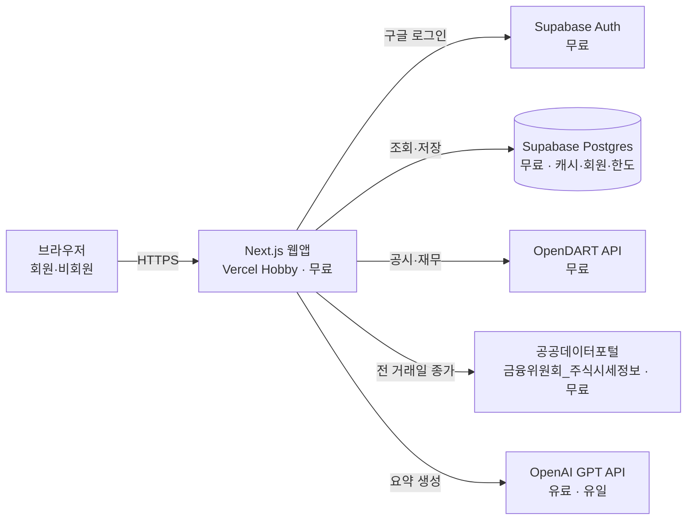
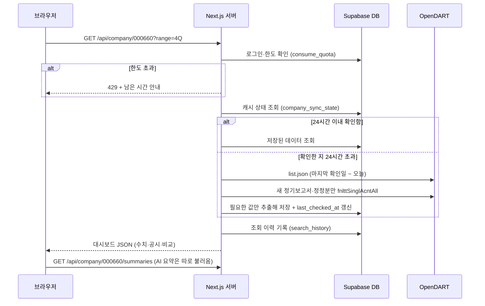

# TECH_SPEC — 기업 공시 기반 투자 인사이트 대시보드

| 항목 | 내용 |
|---|---|
| 프로젝트 | project_sleepyheads |
| 문서 종류 | TECH_SPEC (기술 명세) |
| 작성자 | Sung, Hyun-Joon |
| 작성일 | 2026-09-28 |
| 버전 | v0.2 |
| 기준 PRD | [PRD.md](./PRD.md) v0.3 |

### 변경 이력
| 버전 | 날짜 | 내용 |
|---|---|---|
| v0.1 | 2026-09-28 | 초안 |
| v0.2 | 2026-09-28 | 무료 서비스 구성·한도(§2.1) 추가, LLM을 OpenAI GPT API로 변경, 로그인 구글 단일화, 12월 외 결산 기업의 달력 분기 환산 규칙(§5.3), 금융사 부채비율 주석 규칙, DB 용량 절약 설계 |

> 이 문서는 PRD의 "무엇을 만들지"를 "어떻게 만들지"로 옮긴 것이다. 기능 ID(F-xx)는 PRD의 요구사항 ID를 그대로 쓴다.

---

## 0. 설계 원칙

1. **비상업 수업용 프로젝트** — 광고·결제·유료 기능을 만들지 않는다.
2. **무료 우선** — 모든 구성 요소는 무료 API·무료 플랜으로 고른다. **유료는 OpenAI GPT API 하나**뿐이다.
3. **무료 한도 안에서 동작** — 각 서비스의 무료 한도(§2.1)를 설계 제약으로 삼는다. 넘을 위험이 있는 곳에는 저장·재사용·사용 한도를 둔다.
4. **같은 기준으로 계산** — 모든 지표는 버전이 붙은 하나의 계산식(§5)으로 만든다.

---

## 1. 시스템 구성



- **외부 API는 모두 서버(Next.js 서버 코드)에서만 호출**한다. 브라우저는 우리 서버만 부른다. 그래야 인증키가 브라우저에 노출되지 않는다.
- 데이터는 **요청 시 수집 → DB 저장 → 재사용**한다 (PRD F-D1~D3).

---

## 2. 기술 스택

| 영역 | 선택 | 비용 | 이유 |
|---|---|---|---|
| 웹 프레임워크 | **Next.js (App Router) + TypeScript** | 무료(오픈소스) | 화면과 서버 API를 한 프로젝트에서 관리 |
| 호스팅 | **Vercel Hobby** | 무료 | Next.js 공식 호스팅, GitHub 푸시로 자동 배포. Hobby는 **비상업·개인용 전용**이라 본 프로젝트 성격과 일치 |
| DB | **Supabase Postgres (Free)** | 무료 | 관리형 Postgres, RLS(행 단위 접근 제어)로 회원 데이터 보호 |
| 로그인 | **Supabase Auth + Google** | 무료 | 구글 로그인 단일 제공 (최종본까지 유지) |
| 차트 | **Recharts** | 무료(오픈소스) | React용 차트 라이브러리, 막대·선 차트와 툴팁 기본 제공 |
| 스타일 | Tailwind CSS | 무료(오픈소스) | 반응형 화면을 빠르게 구성 |
| LLM | **OpenAI GPT API** (`openai` npm 패키지) | **유료** | §9 참조 |
| 테스트 | Vitest(계산 로직), Playwright(화면 흐름) | 무료(오픈소스) | |
| 패키지 관리 | pnpm | 무료 | |
| 코드 저장소 | GitHub 공개 저장소 | 무료 | |
| 도메인 | Vercel 기본 주소(`*.vercel.app`) | 무료 | 유료 도메인은 구매하지 않음 |

### 2.1 무료 서비스 한도와 대응 (공식 문서 확인, 2026-09-28 기준)
| 서비스 | 무료 한도 | 우리 설계에서의 대응 |
|---|---|---|
| **Vercel Hobby** | 서버 함수 최대 실행 **300초**, Active CPU **월 4 CPU-시간**, 함수 호출 월 100만 회, 데이터 전송 월 100GB. 한도 초과 시 해당 기능이 **최대 30일 중지**될 수 있음. **비상업·개인용 전용** | 외부 API 결과 캐시로 서버 연산 최소화, AI 요약은 화면과 분리해 비동기 처리, 사용 한도(§8) |
| **Supabase Free** | DB **500MB**, 월 활성 사용자 5만 명, 활성 프로젝트 2개, 전송량 5GB. **1주일 동안 사용이 없으면 프로젝트가 일시정지**됨 | 원본 응답은 저장하지 않고 필요한 값만 저장(§11.5), 용량 400MB 도달 시 경고. 시연·발표 전 프로젝트 상태 확인 |
| **OpenDART** | 무료, 인증키당 일일 요청 한도(약 2만 건) | 저장·재사용, 회원별 한도(§8) |
| **공공데이터포털 주가 API** | 무료, 개발 계정 **하루 10,000건**, 이용 조건: 출처표시·상업적 이용금지·변경금지 | 종목별 하루 1회만 호출, 출처·비상업 안내 표시 |
| **Google 로그인** | 무료 | — |
| **OpenAI GPT API** | **유료 (종량제)** | 저렴한 모델 선택, 요약 저장·재사용, 하루 생성 상한, OpenAI 계정 월 예산 상한 설정 (§9) |

---

## 3. 외부 데이터 소스

### 3.1 OpenDART (https://opendart.fss.or.kr)

| 용도 | API (엔드포인트) | 호출 시점 | 비고 |
|---|---|---|---|
| 기업 고유번호 목록 | 고유번호 (`corpCode.xml`) | 하루 1회 시스템 동기화 | ZIP 파일. 검색 자동완성용 `companies` 테이블 갱신 |
| 기업 기본 정보 | 기업개황 (`company.json`) | 기업 첫 조회 시, 이후 30일마다 | 업종코드(`induty_code`), **결산월(`acc_mt`)**, 대표자 |
| 공시 목록 | 공시검색 (`list.json`) | 조회 시 마지막 확인 이후분만 | `pblntf_ty`로 정기(A)·주요사항(B)·지분(D)·거래소(I) 구분, 페이지당 최대 100건 |
| 공시 원문 | 공시서류원본파일 (`document.xml`) | AI 공시 요약 생성 시 | ZIP, 중요 공시에만 사용 |
| 전체 재무제표 | 단일회사 전체 재무제표 (`fnlttSinglAcntAll.json`) | 보고서별 1회 (재사용) | `fs_div`=CFS(연결)/OFS(별도) |
| 섹터 비교용 주요계정 | 다중회사 주요계정 (`fnlttMultiAcnt.json`) | 섹터 중앙값 계산 시 | 호출당 최대 100개사 |
| 배당 | 배당에 관한 사항 | 사업보고서 기준 1회 | P1 |
| 최대주주 | 최대주주 현황 | 정기보고서 기준 1회 | |
| 주요사항 구조화 데이터 | 주요사항보고서 주요정보 (유상증자 결정 등) | AI 공시 요약 생성 시 | 원문보다 우선 사용 |

**확인된 제약** (공식 개발가이드 확인)
- 재무정보는 `bsns_year` **2015년 이후**만 제공.
- `reprt_code`: `11013` 1분기 / `11012` 반기 / `11014` 3분기 / `11011` 사업보고서. 이 분기는 **회사의 회계연도 기준**이다 (12월 결산이 아니면 달력 분기와 다름 → §5.3).
- 다중회사 조회 최대 100개사 (초과 시 오류 `021`).
- 일일 요청 한도 초과 시 오류 `020` (약 2만 건 수준, 정확한 값은 키 발급 후 확인해 설정값에 반영).

### 3.2 공공데이터포털 — 금융위원회_주식시세정보
- 주소: https://www.data.go.kr/data/15094808/openapi.do
- 용도: **전 거래일 종가, 상장주식수** → 시가총액·PER·PBR 계산.
- 갱신: 기준일 **다음 영업일 오후 1시 이후**.
- 한도: 개발 계정 **하루 10,000건**.
- 이용 조건: **출처표시, 상업적 이용금지, 변경금지** → 비상업 수업용으로만 사용하고, 화면에 출처와 비상업 안내 문구를 표시한다 (§13.1).
- 호출 규칙: 종목별 **하루 1회**만 호출하고 `stock_prices`에 저장.

### 3.3 OpenAI GPT API
- §9 AI 요약 참조.

---

## 4. 데이터 수집·재사용 흐름 (Q5)

### 4.1 기업 조회 요청 처리



- **AI 요약은 화면을 막지 않는다.** 수치가 먼저 뜨고, 요약은 준비되면 채워진다 (자리표시 → 요약).
- 외부 API 호출은 **동시에 최대 5개**까지 병렬로 처리한다.

### 4.2 최신성 규칙
| 데이터 | 다시 가져오는 조건 |
|---|---|
| 재무제표 (보고서 단위) | 한 번 저장하면 재사용. 공시 목록에 **정정 공시**(`[기재정정]` 등)가 나오면 해당 보고서만 다시 수집 |
| 공시 목록 | 마지막 확인 후 24시간이 지나면 그 이후분만 추가 수집 |
| 기업개황 | 30일 경과 시 |
| 주가 | 새 영업일 데이터가 나온 뒤 첫 조회 시 (종목별 하루 1회) |
| AI 요약 | 입력 데이터(보고서·공시)가 바뀌었을 때만 새로 생성 |

### 4.3 조회 기간 (F-P1~P4)
- 기본: **최근 4개 분기**(분기 보기), **최근 3개 연도**(연간 보기). 분기·연도는 모두 **1~12월 달력 기준**(§5.3).
- 최대: **2015년 1분기 ~ 최신 보고서** (OpenDART 제공 범위).
- 필요한 보고서 = 선택 기간을 덮는 모든 정기보고서. 이미 저장된 보고서는 호출하지 않는다.
- 기본보다 긴 기간을 요청하면 **기간 확장 조회** 한도를 1회 차감한다 (§8).

---

## 5. 계산 규칙 (Q1) — `calc_version = v1`

> **원칙: 모든 기업, 모든 화면에 같은 계산식을 쓴다.** 계산식을 바꾸면 `calc_version`을 올리고 이 문서에 기록한다. 저장된 계산값에는 `calc_version`이 함께 저장된다.

### 5.1 재무제표 선택
1. 연결재무제표(CFS)를 우선 사용한다.
2. 연결이 없으면 별도재무제표(OFS)를 쓰고 화면에 `별도 기준` 표시를 붙인다.
3. 한 기업의 조회 기간 안에서는 같은 기준(CFS 또는 OFS)만 쓴다. 섞이면 해당 기간에 경고를 표시한다.
4. 금액 단위는 **원**으로 저장하고(`bigint`), 화면에서만 억 원·조 원으로 바꿔 보여준다.

### 5.2 회계 분기 단독 실적 (손익계산서 항목)
먼저 회사의 **회계연도 기준**으로 분기별 3개월 실적을 구한다.

| 회계 분기 | 계산식 |
|---|---|
| 회계 1분기 | 1분기 보고서 당기 3개월 값 |
| 회계 2분기 | 반기 보고서 당기 3개월 값 |
| 회계 3분기 | 3분기 보고서 당기 3개월 값 |
| **회계 4분기** | **사업보고서 연간 값 − 3분기 보고서 누적(9개월) 값** |

- 3개월 값이 비어 있으면 `당기 누적 − 직전 보고서 누적`으로 계산한다.
- 재무상태표 항목(자산·부채·자본)은 해당 분기말 값을 그대로 쓴다.

### 5.3 달력 분기 환산 (F-P11) — 결산월이 12월이 아닌 기업

모든 기업을 **1~12월 달력 분기**로 맞춘다. (달력 1Q = 1~3월, 2Q = 4~6월, 3Q = 7~9월, 4Q = 10~12월)

**규칙**
1. 각 회계 분기의 **기간 종료월**을 구한다. 기간 종료월은 보고서 제목의 기간 표기(예: `분기보고서 (2026.06)`)를 1순위로 쓰고, 없으면 결산월(`acc_mt`)로 계산한다.
2. 회계 분기 단독 실적(§5.2)을 **기간 종료월이 속한 달력 분기**에 배정한다.
3. **달력 연간 값** = 그 해 달력 1Q~4Q 단독 실적의 합. 네 분기 중 하나라도 없으면 연간 값을 표시하지 않는다.
4. 달력 연간의 재무상태표 값 = 그 해 달력 4Q말(12월 말에 해당하는 분기말) 값.
5. 화면에 "○월 결산 — 달력 분기로 환산" 표시를 붙인다.

**예시: 3월 결산 기업**
| 회사 보고서 | 기간 | 기간 종료월 | → 달력 분기 |
|---|---|---|---|
| 회계 1분기 보고서 | 4~6월 | 6월 | 2Q |
| 반기 보고서 | 7~9월 (3개월) | 9월 | 3Q |
| 회계 3분기 보고서 | 10~12월 (3개월) | 12월 | 4Q |
| 사업보고서 − 3분기 누적 | 다음 해 1~3월 | 3월 | 다음 해 1Q |

- 12월 결산 기업은 회계 분기 = 달력 분기라 변환 결과가 같다.
- 결산월이 3·6·9·12월이 아니면 회계 분기 경계가 달력 분기와 어긋난다. 이 경우에도 규칙 2로 배정하고, `분기 경계 불일치` 주석을 붙인다.
- 비교 분석은 **같은 달력 분기끼리** 비교한다. 비교 기업이 그 분기를 아직 공시하지 않았으면 가장 최근 분기를 쓰고 "기준 분기 다름" 표시를 붙인다.
- TTM(최근 4개 분기 합)과 YoY·QoQ도 달력 분기 기준으로 계산한다.

### 5.4 지표 정의
| 지표 | 계산식 | 비고 |
|---|---|---|
| 매출 | 매출액 (금융업: 영업수익, §6) | |
| 영업이익률 | 영업이익 ÷ 매출 × 100 | 같은 기간 |
| 순이익률 | 당기순이익 ÷ 매출 × 100 | |
| YoY 증감률 | (이번 값 − 전년 같은 분기 값) ÷ \|전년 같은 분기 값\| × 100 | 전년 값이 0이면 표시 안 함 |
| QoQ 증감률 | (이번 값 − 직전 분기 값) ÷ \|직전 분기 값\| × 100 | |
| TTM 지배주주 순이익 | 최근 4개 달력 분기 단독 지배주주 순이익 합계 | TTM = 최근 12개월 |
| ROE | TTM 지배주주 순이익 ÷ 평균 지배주주지분 × 100 | 평균 = (최근 분기말 + 4개 분기 전 분기말) ÷ 2. 4개 분기 전 값이 없으면 최근 분기말 값만 사용 |
| 부채비율 | 부채총계 ÷ 자본총계 × 100 | 금융사는 주석 표시(§6) |
| 자기자본비율 | 자본총계 ÷ 자산총계 × 100 | 모든 업종 공통 |
| 시가총액 | 기준일 종가 × 상장주식수 | **보통주만**. 기준일 = 조회 시점에 제공되는 가장 최근 거래일 |
| PER | 시가총액 ÷ TTM 지배주주 순이익 | TTM ≤ 0 이면 `적자` 표시, 계산 안 함 |
| PBR | 시가총액 ÷ 최근 분기말 지배주주지분 | 지분 ≤ 0 이면 `자본잠식` 표시 |

- 화면 표시: 비율은 소수점 첫째 자리, 배수(PER·PBR)는 소수점 둘째 자리까지 반올림.
- 화면의 각 지표 옆 ⓘ 아이콘에 위 계산식을 그대로 보여준다 (PRD §6.5.2).

### 5.5 계정 식별
- 재무제표 항목은 먼저 **표준 계정 ID**(`account_id`, 예: `ifrs-full_Revenue`, `dart_OperatingIncomeLoss`, `ifrs-full_ProfitLoss`, `ifrs-full_ProfitLossAttributableToOwnersOfParent`, `ifrs-full_Equity`, `ifrs-full_EquityAttributableToOwnersOfParent`, `ifrs-full_Liabilities`, `ifrs-full_Assets`)로 찾는다.
- 없으면 `account_map` 테이블의 **계정명 대체 목록**(예: 매출 → `매출액`, `수익(매출액)`, `영업수익`)을 우선순위대로 찾는다.
- 끝내 못 찾으면 해당 지표를 `데이터 없음`으로 표시하고 `data_issues` 테이블에 기록한다 (추측 금지).

---

## 6. 금융업 공통 지표 변환 (Q6)

은행·증권·보험은 매출·원가 구조가 달라 일반 기업과 같은 계정으로 비교할 수 없다. 아래 규칙으로 **같은 뜻의 공통 지표**로 바꿔 비교한다.

| 공통 지표 | 일반 기업 | 금융업 |
|---|---|---|
| 매출 | 매출액 | 영업수익 |
| 영업이익 | 영업이익 | 영업이익 |
| 순이익 | 당기순이익 | 당기순이익 |
| 영업이익률 | 영업이익 ÷ 매출액 | 영업이익 ÷ 영업수익 |
| ROE · PER · PBR | 동일 식 | 동일 식 |

### 6.1 재무 안정성 지표 표시 규칙 (F-C5a, F-C5b)
| 표시 형태 | 규칙 |
|---|---|
| **비교표** | **부채비율**과 **자기자본비율**을 모두 보여준다. 금융사도 계산이 가능하면 부채비율을 표시하되, 기업명과 값에 `※`를 붙이고 표 아래에 주석을 단다 |
| **그래프** | 비교군에 금융사가 한 곳이라도 있으면 안정성 그래프는 모든 기업을 **자기자본비율**로 그린다. 금융사가 없으면 부채비율 그래프를 쓴다 |

**표 아래 주석 문구**
> ※ 금융회사는 고객 예금·보험계약 등이 부채로 잡히는 구조라 일반 기업보다 부채비율이 높게 나타날 수 있습니다.

- 금융업 여부는 섹터(§7)가 `은행`, `증권`, `보험`, `금융지주`인 경우로 판단한다 (`sectors.is_financial`).
- 비교 영역 상단에 "금융업 포함 — 공통 지표로 변환" 표시를 붙인다.

---

## 7. 섹터 분류 (Q3)

### 7.1 섹터 목록 (초안 v1)
개인투자자들이 통상 쓰는 범주를 기준으로 한다.

| 그룹 | 섹터 |
|---|---|
| IT·전자 | 반도체, 디스플레이, 전자부품·장비, 2차전지 |
| 인터넷·콘텐츠 | 인터넷/플랫폼, 게임, 엔터/미디어, 통신 |
| 산업재 | 자동차/부품, 조선, 방산, 기계/로봇, 건설, 운송/물류, 항공/해운 |
| 소재·에너지 | 화학, 철강/비철금속, 정유/에너지, 전력/유틸리티 |
| 헬스케어 | 제약, 바이오, 의료기기 |
| 소비재 | 음식료, 화장품, 유통, 의류/생활, 여행/레저 |
| 금융 | 은행, 증권, 보험, 금융지주 |
| 기타 | 지주회사, 기타 |

### 7.2 분류 규칙 (우선순위 순)
1. **수동 지정표**(`sector_overrides`): 시가총액 상위 기업과 분류가 애매한 기업(예: 2차전지 소재를 만드는 화학사)은 사람이 직접 지정한다. 예: SK하이닉스(000660) → 반도체.
2. **업종코드 규칙**(`sector_rules`): 기업개황의 업종코드(KSIC, 한국표준산업분류) 앞자리로 자동 분류한다. 예: `261`(반도체 제조업) → 반도체, `21`(의약품 제조업) → 제약, `30`(자동차 제조업) → 자동차/부품, `311`(선박 건조업) → 조선, `64`(금융업) → 은행/금융지주, `65`(보험업) → 보험.
3. 둘 다 해당 없으면 `기타`.

- 매핑표는 저장소의 시드 파일(`supabase/seed/sectors.csv`)로 관리하고 버전(`sector_version`)을 붙인다.
- 화면에 분류 근거를 표시한다 (`직접 지정` / `업종코드 기준`).

---

## 8. 사용 한도 설계 (G6)

### 8.1 산정 근거
OpenDART 일일 한도 **약 20,000건**을 기준으로 계산한다.

**기업 1곳을 처음 조회할 때 드는 OpenDART 호출 수 (추정)**
| 항목 | 호출 수 |
|---|---|
| 기업개황 | 1 |
| 공시검색 (12개월) | 1~2 |
| 전체 재무제표 (최근 4개 달력 분기를 덮는 보고서, 연결 없으면 별도 재호출) | 4~8 |
| 최대주주·배당 | 2 |
| 자동 제안 경쟁사 재무 (저장 안 된 경우) | 0~20 |
| AI 공시 요약용 원문·주요사항 | 0~5 |
| **합계** | **약 10~40건** |

- 이미 저장된 기업은 **0~2건**이다 (새 공시 확인만).
- 기간 확장(예: 2015년부터 전체)은 처음 한 번 최대 약 45건이 더 든다.

**배분 계획**
| 구분 | 건수 | 비율 |
|---|---|---|
| 시스템 예약 (고유번호 동기화, 비로그인 SK하이닉스 화면 갱신, 여유분) | 4,000 | 20% |
| 회원 사용분 | 16,000 | 80% |

- 회원 1인이 하루 최대로 써도 외부 API 소모는 **400건**에서 막힌다(숨은 한도). → 회원 사용분 16,000건을 소진하려면 최대 사용자가 **40명 이상** 있어야 한다. 소수의 집중 사용으로는 한도가 차지 않는다.
- 일반 사용(하루 20개 기업, 절반 정도가 저장된 기업)은 1인당 약 200~400건이다.

### 8.2 한도 값 (설정값 `quota_config` 테이블, 관리자가 변경 가능)
| 키 | 기본값 | 의미 |
|---|---|---|
| `company_views_per_day` | 20 | 새 기업 조회 (같은 날 같은 기업 재조회는 미차감) |
| `range_views_per_day` | 5 | 기간 확장 조회 |
| `requests_per_minute` | 10 | 분당 요청 수 |
| `dart_calls_per_user_per_day` | 400 | 회원별 외부 API 소모 상한 (숨은 한도) |
| `dart_global_soft_limit` | 16,000 | 넘으면 회원의 **새 수집 중단**, 저장된 데이터만 제공 |
| `dart_global_hard_limit` | 19,000 | 넘으면 시스템 수집도 중단 |
| `price_calls_per_day` | 8,000 | 주가 API 하루 상한 (무료 한도 10,000건의 80%) |
| `llm_new_summaries_per_day` | 200 | 서비스 전체 하루 신규 AI 요약 생성 수 (§9.1 비용) |

- 하루 기준: **한국 시간 00:00** 초기화.
- 경쟁사 직접 추가는 `company_views_per_day`에서 1회 차감한다. 자동 제안 경쟁사는 차감하지 않는다.

### 8.3 구현
- DB 함수 `consume_quota(user_id, kind, corp_code)`: 한 트랜잭션 안에서 한도 확인과 차감을 같이 한다 (동시에 두 번 눌러도 한 번만 차감).
- 모든 OpenDART 호출은 공통 래퍼 `dartFetch()`를 거친다. 래퍼가 `dart_usage_daily`(전체)와 `usage_daily.dart_calls`(회원별)를 올리고, 상한을 넘으면 호출하지 않고 `QuotaExceeded`를 던진다. 주가 API는 `priceFetch()`로 같은 방식 적용.
- OpenDART가 `020`을 돌려주면 그날 남은 시간 동안 새 수집을 모두 중단한다.

---

## 9. AI 요약 (Q2) — OpenAI GPT API

### 9.1 모델과 비용
| 항목 | 값 |
|---|---|
| 제공자 | **OpenAI GPT API** (`openai` npm 패키지, 서버에서만 호출) |
| 모델 | **`gpt-6-luna`** — OpenAI 공식 문서가 "비용에 민감한 대량 작업용"으로 권장하는 가장 저렴한 최신 모델 |
| 가격 | 입력 **$0.10** / 출력 **$0.50** (100만 토큰당, 2026-09-28 공식 가격표 기준) |
| 호출 방식 | Responses API + **Structured Outputs**(JSON 스키마를 강제해 정해진 형식으로만 답하게 하는 기능) |
| 상향 옵션 | 요약 품질이 부족하면 `gpt-6-sol`(입력 $2 / 출력 $10)로 교체 — **현준님 결정 사항** (T4) |

**비용 추정**
- 요약 1건 = 입력 약 6,000토큰 + 출력 최대 약 2,000토큰 → **약 $0.0016 (약 2~3원)**.
- 하루 신규 요약 상한 200건 → **최대 약 $0.3/일, 월 약 $10 이하**.
- 저장·재사용하므로 같은 요약은 다시 돈이 들지 않는다.
- OpenAI 계정에 **월 예산 상한**을 걸어 예상 밖 과금을 막는다 (설정 위치는 작업 단계에서 공식 화면 확인 후 안내).

### 9.2 요약 종류
| 종류 | 입력 | 출력 | 저장 키 |
|---|---|---|---|
| 실적 요약 (F-X1) | 최근 분기 계산값 (§5 결과) | 2~3문장 | `corp_code + 기준 분기 + calc_version` |
| 공시 요약 (F-X2) | 주요사항 구조화 데이터 우선, 없으면 원문 본문 | 3줄 이내 | `rcept_no`(공시 접수번호) |
| 비교 요약 (F-X3, P1) | 비교표 수치 | 1~2문장 | 비교 대상 목록 해시 |

- 원문 본문이 길면 앞부분 최대 30,000자까지만 쓰고, 요약에 `요약 범위: 원문 앞부분` 표시를 붙인다.

### 9.3 출력 형식 (JSON 스키마)
```json
{
  "summary": ["문장1", "문장2"],
  "figures_used": [{ "label": "영업이익 YoY", "value": "32.1%" }],
  "tone": "positive | negative | neutral | mixed"
}
```

### 9.4 안전장치 (F-X4, F-X5)
1. 지시문에 **"제공된 데이터만 근거로 쓸 것, 투자 권유 표현 금지"** 를 명시한다.
2. `figures_used`의 모든 숫자가 입력 데이터에 있는지 서버에서 대조한다. 하나라도 없으면 폐기한다.
3. 금지어 검사: `매수`, `매도`, `추천`, `목표주가`, `사야`, `팔아` 등이 있으면 폐기한다.
4. API 오류 시 1회 재시도, 그래도 실패하거나 폐기되면 **규칙 기반 문장**으로 대체한다 (예: "영업이익이 전년 동기 대비 32.1% 증가").
5. 화면에 `AI 요약` 표시를 붙인다.

---

## 10. 인증·권한 (Q4)

### 10.1 로그인
| 항목 | 내용 |
|---|---|
| 제공자 | **구글 단일** (최종본까지 유지) |
| 연결 방식 | Supabase Auth의 Google 제공자 (구글 클라우드에서 OAuth 클라이언트 발급 — 무료) |
| 세션 | Supabase Auth가 쿠키로 관리 (`@supabase/ssr`) |
| 비밀번호 | 저장하지 않음 |

- 최초 로그인 시 `profiles`에 행을 만들고 약관 동의 시각을 기록한다. 동의 전에는 기능을 쓸 수 없다.

### 10.2 접근 규칙
| 경로 | 비로그인 | 로그인 |
|---|---|---|
| `/` (SK하이닉스 기본 화면) | ✅ 보기만 | ✅ |
| `/company/[stockCode]` | ❌ → `/login?next=...` | ✅ |
| `/me` (조회 이력·남은 한도) | ❌ | ✅ |
| `/api/guest/default` | ✅ (저장 데이터만) | ✅ |
| 그 밖의 `/api/*` | ❌ 401 | ✅ |

- Next.js `middleware`에서 로그인 여부를 확인해 리다이렉트한다.
- 비로그인 화면의 버튼(검색·기간 변경·경쟁사 추가 등)은 누르면 로그인 안내 모달을 띄우고 `/login?next=<원래 경로>`로 보낸다.

### 10.3 비로그인 SK하이닉스 화면 (F-G1)
- 종목코드 `000660` 고정. 데이터는 **저장된 데이터만** 보여준다.
- 데이터 갱신은 시스템 예약분(§8.1)으로, 저장 데이터가 24시간을 넘었을 때 첫 방문 요청에서 1회 수행한다.

---

## 11. DB 스키마 (초안)

> 🔒 = RLS로 **본인 행만** 읽기·쓰기 가능. 🗄️ = 공유 캐시, 브라우저에서 직접 접근 불가(서버만 접근).

### 11.1 회원·사용량
| 테이블 | 주요 컬럼 | 비고 |
|---|---|---|
| `profiles` 🔒 | `id`(=auth.users.id), `nickname`, `email`, `agreed_terms_at`, `created_at` | 탈퇴 시 삭제 |
| `search_history` 🔒 | `id`, `user_id`, `corp_code`, `range_from`, `range_to`, `viewed_at` | F-S5, F-D4 |
| `usage_daily` 🔒(읽기만) | `user_id`, `day_kst`, `company_views`, `range_views`, `dart_calls` | PK(user_id, day_kst) |
| `user_company_views` 🗄️ | `user_id`, `day_kst`, `corp_code` | 같은 날 재조회 미차감 판정 |
| `quota_config` 🗄️ | `key`, `value` | §8.2 |
| `api_usage_daily` 🗄️ | `day_kst`, `provider`(dart/price/llm), `calls`, `input_tokens`, `output_tokens`, `blocked_at` | 서비스 전체 사용량 |

### 11.2 기업·섹터
| 테이블 | 주요 컬럼 |
|---|---|
| `companies` 🗄️ | `corp_code`(PK), `stock_code`, `corp_name`, `market`, `induty_code`, `sector_id`, `sector_source`, `acc_mt`(결산월), `updated_at` |
| `sectors` 🗄️ | `id`, `name`, `group_name`, `is_financial`, `sector_version` |
| `sector_overrides` 🗄️ | `stock_code`, `sector_id`, `note` |
| `sector_rules` 🗄️ | `induty_prefix`, `sector_id`, `priority` |

### 11.3 수집 데이터 (캐시)
| 테이블 | 주요 컬럼 |
|---|---|
| `company_sync_state` 🗄️ | `corp_code`, `last_checked_at`, `last_rcept_dt` |
| `report_values` 🗄️ | `corp_code`, `bsns_year`, `reprt_code`, `fs_div`, `period_end`(기간 종료일), `source_rcept_no`, 필요한 계정 값(`revenue`, `operating_income`, `net_income`, `net_income_owners`, `assets`, `liabilities`, `equity`, `equity_owners` 각각 3개월·누적), `fetched_at` |
| `calendar_quarter_metrics` 🗄️ | `corp_code`, `cal_year`, `cal_quarter`, `fs_div`, 단독 실적·분기말 값, `boundary_mismatch`, `calc_version` |
| `account_map` 🗄️ | `metric`, `priority`, `account_id`, `account_nm`, `industry_type` |
| `disclosures` 🗄️ | `rcept_no`(PK), `corp_code`, `report_nm`, `rcept_dt`, `pblntf_ty`, `issue_tag`, `importance`, `is_correction` |
| `stock_prices` 🗄️ | `stock_code`, `base_date`, `close_price`, `listed_shares`, `fetched_at` |
| `llm_summaries` 🗄️ | `cache_key`(PK), `kind`, `model`, `summary_json`, `input_hash`, `created_at` |
| `data_issues` 🗄️ | `corp_code`, `kind`(계정 못 찾음 등), `detail`, `created_at` |

### 11.4 중요 공시 분류표 (F-I2) — `issue_rules`
공시 제목(`report_nm`)에 포함된 문구로 분류한다.

| 태그 | 포함 문구 예시 | 중요도 |
|---|---|---|
| `자금조달` | 유상증자결정, 전환사채권발행결정, 신주인수권부사채권발행결정, 교환사채권발행결정 | 상 |
| `주주환원` | 자기주식취득결정, 자기주식소각결정, 현금ㆍ현물배당결정 | 상 |
| `구조변화` | 회사합병결정, 회사분할결정, 영업양수, 영업양도, 타법인주식및출자증권취득결정 | 상 |
| `자본감소` | 감자결정 | 상 |
| `위험` | 부도발생, 영업정지, 회생절차개시신청, 해산사유발생, 소송등의제기 | 상 |
| `지배구조` | 최대주주변경 | 상 |
| `실적` | 매출액또는손익구조, 영업(잠정)실적 | 중 |
| `계약` | 단일판매ㆍ공급계약체결 | 중 |
| `지분변동` | 주식등의대량보유상황보고서, 임원ㆍ주요주주특정증권등소유상황보고서 | 하 (건수 집계만 표시) |

- 제목에 `[기재정정]`, `[첨부정정]` 등이 있으면 `is_correction = true`로 표시하고 원 공시와 묶어 보여준다.
- **중요도 `상`·`중` 공시만 행으로 저장**하고, `하`는 기업·월별 건수만 저장한다 (용량 절약).

### 11.5 무료 DB 용량(500MB) 관리
| 규칙 | 이유 |
|---|---|
| API **원본 응답(JSON·ZIP)은 저장하지 않는다.** 필요한 계정 값만 뽑아 `report_values`에 저장 | 전체 재무제표 원본은 보고서당 수십 KB로, 상장사 전체를 저장하면 500MB를 넘는다 |
| 공시 원문 본문은 저장하지 않고, AI 요약 결과만 저장 | 원문은 필요하면 다시 받을 수 있다 |
| `하` 중요도 공시는 건수만 저장 | 지분 공시는 건수가 매우 많다 |

**용량 추정 (상장사 약 2,700곳 × 2015년~ 약 44개 보고서를 모두 채운 최악의 경우)**
- `report_values`: 약 12만 행 × 약 300B ≈ **약 36MB**
- `calendar_quarter_metrics`: 약 12만 행 × 약 200B ≈ **약 24MB**
- 그 밖의 테이블 합계: 수십 MB 이내
- → 최악의 경우에도 약 100~150MB로 **500MB 안에 들어온다.** 400MB 도달 시 로그 경고.

---

## 12. 서버 API (Next.js Route Handlers)

| 메서드·경로 | 설명 | 한도 차감 |
|---|---|---|
| `GET /api/search?q=` | 자동완성 (DB만 조회, 외부 호출 없음) | 분당 요청 수만 |
| `GET /api/company/[stockCode]?from=2025Q3&to=2026Q2&view=quarter` | 대시보드 데이터 (기간은 달력 분기 `YYYYQn`) | 기업 조회 1회 (+ 기간 확장 시 1회) |
| `GET /api/company/[stockCode]/summaries` | AI 요약 (준비 중이면 `pending`) | 없음 |
| `POST /api/company/[stockCode]/peers` | 경쟁사 추가·삭제 `{ add?: string, remove?: string }` | 추가 시 기업 조회 1회 |
| `GET /api/me/usage` | 오늘 남은 한도 | 없음 |
| `GET /api/me/history` | 내 조회 이력 | 없음 |
| `DELETE /api/me` | 회원 탈퇴 | 없음 |
| `GET /api/guest/default` | 비로그인 SK하이닉스 데이터 | 없음 (시스템 예약분) |

**오류 응답 공통 형식**
```json
{ "error": { "code": "QUOTA_EXCEEDED", "message": "오늘 조회 한도를 모두 사용했습니다.", "resetAt": "2026-09-29T00:00:00+09:00" } }
```
| code | HTTP | 뜻 |
|---|---|---|
| `UNAUTHORIZED` | 401 | 로그인 필요 |
| `TERMS_REQUIRED` | 403 | 약관 동의 필요 |
| `QUOTA_EXCEEDED` | 429 | 회원 한도 초과 |
| `RATE_LIMITED` | 429 | 분당 요청 초과 |
| `SERVICE_BUDGET` | 503 | 서비스 전체 수집 중단 (저장된 데이터만 가능) |
| `NOT_FOUND` | 404 | 상장사 아님 / 없는 종목 |
| `UPSTREAM_ERROR` | 502 | 외부 API 오류 |

---

## 13. 화면 구성

| 경로 | 화면 | 주요 구성 |
|---|---|---|
| `/` | 비로그인 기본 화면 / 로그인 시 검색 홈 | 비로그인: SK하이닉스 대시보드(읽기 전용). 로그인: 검색창 + 최근 조회 |
| `/login` | 로그인 | **구글 로그인 버튼**, 약관 링크, 비상업 안내 문구 |
| `/auth/callback` | 로그인 처리 | Supabase OAuth 콜백 |
| `/onboarding` | 약관 동의 | 최초 1회 |
| `/company/[stockCode]` | 기업 대시보드 | ① 개요·지표 카드 ② 실적 차트 + 기간 설정 ③ AI 실적 요약 ④ 주요 경영사항 + AI 공시 요약 ⑤ 비교 분석 ⑥ 하단 안내 |
| `/me` | 내 정보 | 남은 한도, 조회 이력, 로그아웃, 탈퇴 |
| `/terms`, `/privacy` | 이용약관, 개인정보 처리방침 | |

- 상단 바: 로고, 검색창, **남은 조회 수 배지**(`17/20`), 로그인/내 정보.
- 모바일(너비 768px 미만): 카드 1열, 차트 가로 스크롤 없이 축소, 비교표는 가로 스크롤 허용.

### 13.1 하단 안내 영역 (`<SiteFooter>`, 모든 페이지 공통)
세 가지 문구를 항상 표시한다 (PRD §9, F-Z1·F-Z2·F-Z6).
1. **투자 유의 고지**: 정보 제공 목적, 투자 권유·자문 아님, AI 요약 오류 가능성, 투자 책임은 이용자 본인.
2. **비상업 안내**: 바이브코딩 수업용 비상업 프로젝트, 수익 목적·광고·유료 기능 없음.
3. **출처**: 금융감독원 전자공시(OpenDART), 공공데이터포털 「금융위원회_주식시세정보」(출처: 한국거래소) — 이용 조건(출처표시·상업적 이용금지·변경금지)에 따라 비상업적으로 이용.

---

## 14. 보안

| 항목 | 규칙 |
|---|---|
| 비밀 값 | `OPENDART_API_KEY`, `DATA_GO_KR_SERVICE_KEY`, `OPENAI_API_KEY`, Supabase **secret key**(구 service_role)는 서버 환경변수로만 둔다. 이름에 `NEXT_PUBLIC_`을 붙이지 않는다 |
| 공개 값 | Supabase URL, **publishable key**(구 anon)만 브라우저에 노출 가능 |
| 저장소 | 공개 저장소이므로 `.env*` 파일은 반드시 `.gitignore`에 넣는다. 예시는 `.env.example`(값 없이 이름만) |
| RLS | 모든 테이블에 RLS를 켠다. 회원 테이블은 `auth.uid() = user_id` 정책, 공유 캐시 테이블은 정책 없음(서버의 secret key로만 접근) |
| 입력 검증 | `stockCode`는 6자리 숫자, 기간은 `YYYYQn` 형식만 허용 |
| 남용 방지 | 분당 요청 제한, 회원별 외부 API 상한 (§8) |
| 과금 보호 | OpenAI 월 예산 상한 + 하루 요약 생성 상한 (§9.1) |

---

## 15. 환경·배포

| 환경 | 용도 | 비고 |
|---|---|---|
| 로컬 | 개발 | `pnpm dev`, Supabase 무료 프로젝트 사용 |
| Preview | PR마다 자동 배포 | Vercel Preview |
| Production | 공개 서비스 | `main` 브랜치 푸시 시 배포, 주소 `*.vercel.app` |

**환경변수 목록**
| 이름 | 공개 여부 |
|---|---|
| `NEXT_PUBLIC_SUPABASE_URL` | 공개 |
| `NEXT_PUBLIC_SUPABASE_PUBLISHABLE_KEY` | 공개 |
| `SUPABASE_SECRET_KEY` | 🔒 서버 전용 |
| `OPENDART_API_KEY` | 🔒 서버 전용 |
| `DATA_GO_KR_SERVICE_KEY` | 🔒 서버 전용 |
| `OPENAI_API_KEY` | 🔒 서버 전용 |
| `OPENAI_MODEL` | 서버 전용 (기본값 `gpt-6-luna`, 모델 교체 시 코드 수정 없이 변경) |

> 구글 로그인용 클라이언트 ID·비밀값은 Supabase 대시보드의 Google 제공자 설정에 넣으므로 우리 환경변수에는 없다.

### 15.1 저장소 구조 (안)
```
project_sleepyheads/
├── README.md
├── DevelopDoc/            # 개발 문서
├── src/
│   ├── app/               # 화면(page)과 서버 API(route)
│   ├── components/        # 차트, 카드, 표, SiteFooter 등 화면 조각
│   ├── lib/
│   │   ├── dart/          # OpenDART 호출·파싱 (dartFetch 래퍼)
│   │   ├── price/         # 주가 API (priceFetch 래퍼)
│   │   ├── metrics/       # §5 계산 규칙 (calc_version, 달력 분기 환산)
│   │   ├── sector/        # §7 섹터 분류
│   │   ├── quota/         # §8 사용 한도
│   │   ├── llm/           # §9 AI 요약 (OpenAI)
│   │   └── supabase/      # DB·인증 클라이언트
│   └── middleware.ts      # 로그인 확인
├── supabase/
│   ├── migrations/        # DB 스키마 변경 기록
│   └── seed/              # sectors.csv, account_map.csv, issue_rules.csv
└── tests/
    ├── unit/              # 계산 로직
    ├── fixtures/          # 실제 DART 응답 샘플
    └── e2e/               # 화면 흐름
```

---

## 16. 로그·모니터링

- `api_usage_daily`로 OpenDART·주가 API·OpenAI의 하루 사용량을 확인한다. 각 상한의 80%를 넘으면 서버 로그에 경고를 남긴다.
- Supabase DB 용량이 400MB를 넘으면 경고한다.
- 외부 API 오류는 코드·엔드포인트·기업과 함께 기록한다 (인증키는 기록하지 않음).
- `data_issues`에 쌓인 "계정 못 찾음" 등은 `account_map` 보완에 쓴다.

---

## 17. 테스트 전략

| 종류 | 대상 | 기준 |
|---|---|---|
| 단위 테스트 | §5 계산식 전부, 4분기 계산, **달력 분기 환산**, 금융업 변환, 섹터 분류, 공시 분류, 한도 차감 | 실제 DART 응답 샘플로 DART 원문 수치와 일치. 샘플: 12월 결산(삼성전자·SK하이닉스), 금융업(KB금융), **12월 외 결산 기업 2곳 이상** |
| 통합 테스트 | `dartFetch`·`priceFetch` 한도 차단, 캐시 재사용(두 번째 조회 시 외부 호출 0건) | |
| AI 요약 검증 | 숫자 대조·금지어 필터 | 일부러 틀린 숫자를 넣은 응답이 폐기되는지 |
| 화면 테스트 | 비로그인 → 버튼 클릭 → 로그인 이동, 한도 초과 안내, 하단 안내 문구 3종 표시, 금융사 `※` 주석 표시 | Playwright |
| 보안 점검 | 다른 회원의 조회 이력 접근 불가, 비밀 키가 브라우저 번들·저장소에 없음 | |

---

## 18. 미결정 기술 사항

| # | 항목 | 확인 방법 |
|---|---|---|
| T1 | OpenDART 일일 한도의 정확한 값과 초기화 시각 | 인증키 발급 후 확인해 `quota_config`에 반영 |
| T3 | 처음 조회(외부 호출 최대 40건)가 Vercel Hobby 함수 최대 실행 시간 300초와 월 Active CPU 4시간 안에 드는지 | 첫 구현 후 측정. 부족하면 수집을 나눠 처리 |
| T4 | `gpt-6-luna`의 요약 품질이 충분한지 | 샘플 기업 20곳으로 요약 품질 평가. 모델 상향은 현준님 결정 사항 |
| T5 | 주가 API 필드명·보통주 구분 방법 | API 신청 후 응답 샘플로 확인 |
| T6 | 12월 외 결산 기업 샘플 선정 | 기업개황 `acc_mt`가 12가 아닌 상장사에서 2곳 이상 선정 |
