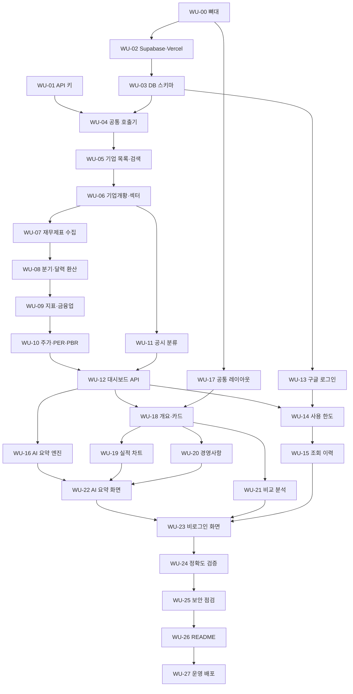

# WORK_UNITS — 단위 작업 명세

| 항목 | 내용 |
|---|---|
| 프로젝트 | project_sleepyheads |
| 문서 종류 | WORK_UNITS (단위 작업 명세) |
| 작성자 | Sung, Hyun-Joon |
| 작성일 | 2026-09-28 |
| 버전 | v0.1 (초안) |
| 기준 문서 | [PRD.md](./PRD.md) v0.3, [TECH_SPEC.md](./TECH_SPEC.md) v0.2 |

---

## 0. 이 문서 사용법

- 개발은 **단위 작업(WU, Work Unit)** 하나씩 진행한다. 하나의 WU는 "끝났는지 아닌지"를 체크리스트로 판단할 수 있는 크기다.
- 각 WU의 **완료조건 체크리스트가 모두 ✅가 되어야 완료**다. 하나라도 비어 있으면 다음 WU로 넘어가지 않는다 (선행 관계가 없는 WU는 병행 가능).
- 완료되면 상단 **진행 현황표**의 상태를 바꾸고, 커밋 메시지에 WU 번호를 적는다 (예: `WU-07: 재무제표 수집 구현`).
- 기능 ID(F-xx)는 PRD, 절 번호(§)는 TECH_SPEC을 가리킨다.

**표기**
| 기호 | 뜻 |
|---|---|
| 🤖 | Claude가 수행 |
| 👤 | 현준님이 직접 수행해야 하는 단계 포함 (계정 가입·키 발급 등). 해당 WU를 시작할 때 **공식 화면을 확인한 뒤** 한 단계씩 안내한다 |
| S / M / L | 작업 규모 (작음 / 보통 / 큼) |
| ⬜ / 🟨 / ✅ | 대기 / 진행 중 / 완료 |

---

## 1. 진행 현황표

### MVP (v1.0)
| WU | 이름 | 단계 | 담당 | 규모 | 선행 | 상태 |
|---|---|---|---|---|---|---|
| WU-00 | 프로젝트 뼈대·개발 환경 | 0. 준비 | 🤖 | S | — | ⬜ |
| WU-01 | 데이터·AI API 키 발급 | 0. 준비 | 👤🤖 | S | — | ⬜ |
| WU-02 | Supabase·Vercel 연결과 첫 배포 | 0. 준비 | 👤🤖 | M | WU-00 | ⬜ |
| WU-03 | DB 스키마·RLS·시드 데이터 | 1. 데이터 기반 | 🤖 | M | WU-02 | ⬜ |
| WU-04 | 외부 API 공통 호출기 | 1. 데이터 기반 | 🤖 | M | WU-01, WU-03 | ⬜ |
| WU-05 | 기업 목록 동기화·검색 API | 1. 데이터 기반 | 🤖 | M | WU-04 | ⬜ |
| WU-06 | 기업개황·섹터 분류 | 1. 데이터 기반 | 🤖 | M | WU-05 | ⬜ |
| WU-07 | 재무제표 수집·저장 | 1. 데이터 기반 | 🤖 | L | WU-06 | ⬜ |
| WU-08 | 계산 엔진 ① 분기 단독·달력 분기 환산 | 2. 계산 | 🤖 | L | WU-07 | ⬜ |
| WU-09 | 계산 엔진 ② 지표·금융업 변환 | 2. 계산 | 🤖 | M | WU-08 | ⬜ |
| WU-10 | 주가 수집·시가총액·PER·PBR | 2. 계산 | 🤖 | M | WU-09 | ⬜ |
| WU-11 | 공시 수집·중요 공시 분류 | 2. 계산 | 🤖 | M | WU-06 | ⬜ |
| WU-12 | 대시보드 데이터 API (캐시·최신성) | 2. 계산 | 🤖 | L | WU-10, WU-11 | ⬜ |
| WU-13 | 구글 로그인·약관 동의·탈퇴 | 3. 회원·한도 | 👤🤖 | M | WU-03 | ⬜ |
| WU-14 | 사용 한도 | 3. 회원·한도 | 🤖 | M | WU-12, WU-13 | ⬜ |
| WU-15 | 조회 이력·내 정보 | 3. 회원·한도 | 🤖 | S | WU-14 | ⬜ |
| WU-16 | AI 요약 엔진 (OpenAI) | 4. AI | 🤖 | L | WU-12 | ⬜ |
| WU-17 | 공통 레이아웃·하단 안내·약관 페이지 | 5. 화면 | 🤖 | M | WU-00 | ⬜ |
| WU-18 | 기업 개요·지표 카드 | 5. 화면 | 🤖 | M | WU-12, WU-17 | ⬜ |
| WU-19 | 실적 차트·기간 설정 | 5. 화면 | 🤖 | L | WU-18 | ⬜ |
| WU-20 | 주요 경영사항 영역 | 5. 화면 | 🤖 | M | WU-18 | ⬜ |
| WU-21 | 비교 분석 영역 | 5. 화면 | 🤖 | L | WU-18 | ⬜ |
| WU-22 | AI 요약 화면 연결 | 5. 화면 | 🤖 | M | WU-16, WU-19, WU-20 | ⬜ |
| WU-23 | 비로그인 SK하이닉스 화면·로그인 유도 | 5. 화면 | 🤖 | M | WU-13, WU-18~22 | ⬜ |
| WU-24 | 데이터 정확도 검증·테스트 보강 | 6. 품질·출시 | 🤖 | M | WU-23 | ⬜ |
| WU-25 | 배포 전 보안·운영 점검 | 6. 품질·출시 | 👤🤖 | M | WU-24 | ⬜ |
| WU-26 | README·운영 문서 | 6. 품질·출시 | 🤖 | S | WU-25 | ⬜ |
| WU-27 | 운영 배포·사용자 테스트 | 6. 품질·출시 | 👤🤖 | M | WU-26 | ⬜ |

### v1.1 (P1 기능)
| WU | 이름 | 담당 | 규모 | 선행 | 상태 |
|---|---|---|---|---|---|
| WU-30 | 재무비율 추이 차트 | 🤖 | S | WU-27 | ⬜ |
| WU-31 | 이슈 타임라인 | 🤖 | M | WU-27 | ⬜ |
| WU-32 | 배당 이력 | 🤖 | S | WU-27 | ⬜ |
| WU-33 | 섹터 중앙값 대비 위치 | 🤖 | M | WU-27 | ⬜ |
| WU-34 | 비교 AI 요약 | 🤖 | S | WU-33 | ⬜ |
| WU-35 | 재무 용어 설명 툴팁 | 🤖 | S | WU-27 | ⬜ |
| WU-36 | 로그인 후 원래 화면 복귀 | 🤖 | S | WU-27 | ⬜ |

### 작업 순서 한눈에 보기

---

## 2. 단계 0 — 준비

### WU-00 프로젝트 뼈대·개발 환경
| 항목 | 내용 |
|---|---|
| 목적 | 모든 작업이 올라갈 빈 앱과 공통 도구(테스트·검사)를 먼저 갖춘다 |
| 관련 | TECH §2, §15.1 |
| 담당 / 규모 | 🤖 / S |

**작업 내용**
- Next.js(App Router) + TypeScript + Tailwind CSS 프로젝트 생성 (pnpm)
- TECH §15.1 폴더 구조 생성
- `.gitignore`(`.env*` 포함), `.env.example`(TECH §15 변수 이름만)
- 코드 검사(ESLint), 형식 정리(Prettier), Vitest, Playwright 설정
- GitHub Actions(공개 저장소 무료)로 푸시마다 검사·테스트 자동 실행

**완료조건**
- [ ] `pnpm dev` 실행 후 `http://localhost:3000`에서 기본 페이지가 뜬다
- [ ] `pnpm lint`, `pnpm test`, `pnpm build`가 오류 없이 끝난다
- [ ] `.env.example`에 TECH §15의 변수 7개가 **값 없이** 들어 있다
- [ ] `.env.local`을 만들어도 `git status`에 나타나지 않는다 (무시됨 확인)
- [ ] GitHub에 푸시하면 Actions 검사가 초록색(통과)으로 끝난다

---

### WU-01 데이터·AI API 키 발급 👤
| 항목 | 내용 |
|---|---|
| 목적 | 외부 데이터와 AI를 쓰려면 각 서비스의 인증키가 필요하다 |
| 관련 | TECH §3, §9.1, §15 |
| 담당 / 규모 | 👤 현준님(가입·발급) + 🤖(키 동작 확인) / S |

**작업 내용**
- 👤 OpenDART 인증키 발급
- 👤 공공데이터포털 「금융위원회_주식시세정보」 활용 신청
- 👤 OpenAI API 키 발급 + **월 예산 상한 설정**
- 👤 키를 `.env.local`에 붙여넣기 (Claude가 파일 위치와 형식 안내)
- 🤖 각 키로 시험 호출 1회씩 해서 동작 확인

**완료조건**
- [ ] OpenDART 시험 호출(SK하이닉스 기업개황)이 정상 응답(status `000`)을 준다
- [ ] 주가 API 시험 호출이 SK하이닉스(000660)의 최근 종가를 돌려준다
- [ ] OpenAI 시험 호출(`gpt-6-luna`, 짧은 문장)이 응답을 돌려준다
- [ ] OpenAI 계정에 월 예산 상한이 설정되어 있다 (현준님 화면 확인)
- [ ] OpenDART 일일 한도의 정확한 값을 확인해 기록했다 (TECH T1)
- [ ] 세 개의 키가 `.env.local`에만 있고, 저장소 어디에도 없다 (`git grep`으로 확인)

---

### WU-02 Supabase·Vercel 연결과 첫 배포 👤
| 항목 | 내용 |
|---|---|
| 목적 | 데이터베이스와 웹 호스팅을 무료 플랜으로 준비하고, 빈 앱을 인터넷에 한 번 올려 배포 경로를 확인한다 |
| 관련 | TECH §2.1, §15 |
| 담당 / 규모 | 👤 현준님(가입·프로젝트 생성) + 🤖(연결·배포 설정) / M |
| 선행 | WU-00 |

**작업 내용**
- 👤 Supabase 무료 프로젝트 생성 (지역: 서울 또는 가장 가까운 곳)
- 👤 Vercel 무료(Hobby) 계정에 GitHub 저장소 연결
- 🤖 Supabase 키를 `.env.local`과 Vercel 환경변수에 넣는 방법 안내, 연결 확인 코드 작성
- 🤖 Supabase CLI로 마이그레이션 폴더 연결

**완료조건**
- [ ] 로컬 앱에서 Supabase 연결 확인 요청이 성공한다
- [ ] `main`에 푸시하면 Vercel이 자동 배포하고, `*.vercel.app` 주소에서 기본 페이지가 뜬다
- [ ] Vercel 환경변수에 서버 전용 키가 `NEXT_PUBLIC_` 없이 등록되어 있다
- [ ] 두 서비스 모두 **무료 플랜**임을 대시보드에서 확인했다 (결제 수단 미등록)

---

## 3. 단계 1 — 데이터 기반

### WU-03 DB 스키마·RLS·시드 데이터
| 항목 | 내용 |
|---|---|
| 목적 | 데이터를 담을 표를 만들고, 회원 데이터는 본인만 보도록 잠근다 |
| 관련 | TECH §7, §8.2, §11, §14 |
| 담당 / 규모 | 🤖 / M |
| 선행 | WU-02 |

**작업 내용**
- TECH §11의 모든 테이블을 마이그레이션 파일로 작성
- 모든 테이블 RLS 활성화: 회원 테이블은 본인 행만, 공유 캐시 테이블은 정책 없음
- 시드 파일: `sectors.csv`(TECH §7.1), `sector_rules.csv`, `sector_overrides.csv`(SK하이닉스 포함 대형주), `account_map.csv`, `issue_rules.csv`(TECH §11.4), `quota_config`(TECH §8.2)

**완료조건**
- [ ] 마이그레이션을 빈 DB에 적용하면 오류 없이 모든 테이블이 생긴다
- [ ] Supabase Security Advisor(보안 진단)에서 "RLS 꺼진 테이블" 경고가 0건이다
- [ ] 테스트: 회원 A로 로그인한 상태에서 회원 B의 `search_history`를 조회하면 0행이 나온다
- [ ] 테스트: 브라우저용 공개 키로 공유 캐시 테이블(`companies` 등)을 조회하면 0행이 나온다
- [ ] 시드 적용 후 `sectors`에 TECH §7.1의 섹터가 모두 있고, `quota_config`에 TECH §8.2의 키 8개가 있다
- [ ] 금융 섹터 4개(`은행`, `증권`, `보험`, `금융지주`)만 `is_financial = true`다

---

### WU-04 외부 API 공통 호출기
| 항목 | 내용 |
|---|---|
| 목적 | 모든 외부 호출이 한 곳을 거치게 해서, 사용량 기록과 한도 차단을 빠짐없이 적용한다 |
| 관련 | TECH §3, §8.3 |
| 담당 / 규모 | 🤖 / M |
| 선행 | WU-01, WU-03 |

**작업 내용**
- `dartFetch()`: 호출 전 전체·회원별 상한 확인 → 호출 → `api_usage_daily` 기록, OpenDART 오류코드(`000`, `013` 데이터 없음, `020` 한도 초과 등) 처리
- `priceFetch()`: 같은 방식, `price_calls_per_day` 적용
- 동시 호출 최대 5개 제한, 실패 시 1회 재시도
- 실제 응답 샘플을 `tests/fixtures/`에 저장 (삼성전자, SK하이닉스, KB금융, 12월 외 결산 기업 2곳 — TECH T6)

**완료조건**
- [ ] 코드 전체에서 OpenDART·주가 API를 직접 부르는 곳이 래퍼 외에 없다 (검색으로 확인)
- [ ] 테스트: 호출 1회마다 `api_usage_daily.calls`가 정확히 1 증가한다
- [ ] 테스트: 회원별 상한(400)에 도달하면 외부 호출 없이 `QuotaExceeded`가 난다
- [ ] 테스트: 전체 soft limit 도달 시 회원 요청은 차단되고, hard limit 도달 시 시스템 요청도 차단된다
- [ ] 테스트: 가짜 `020` 응답을 받으면 그날 새 수집이 모두 중단된다
- [ ] 동시에 10개를 요청해도 실제 동시 호출은 5개를 넘지 않는다
- [ ] 로그에 인증키가 찍히지 않는다
- [ ] 12월 외 결산 샘플 기업 2곳을 정해 문서(TECH T6)에 기록했다

---

### WU-05 기업 목록 동기화·검색 API
| 항목 | 내용 |
|---|---|
| 목적 | 회사명·종목코드로 바로 찾을 수 있게 상장사 목록을 우리 DB에 갖춘다 |
| 관련 | F-S1~S3, TECH §3.1(`corpCode.xml`), §12 |
| 담당 / 규모 | 🤖 / M |
| 선행 | WU-04 |

**작업 내용**
- `corpCode.xml`(ZIP)을 받아 풀고, 종목코드가 있는 **상장사만** `companies`에 저장
- 하루 1회 자동 실행 설정 (무료로 가능한 방법을 작업 시점에 공식 문서로 확인해 선택: Vercel Cron 또는 GitHub Actions 예약 실행)
- `GET /api/search?q=`: 회사명(부분 일치·초성 제외)과 종목코드(앞자리 일치)로 최대 10건 반환, 외부 호출 없음

**완료조건**
- [ ] 동기화 후 `companies`에 상장사가 2,000곳 이상 들어 있고, 종목코드 없는 회사는 없다
- [ ] 동기화를 두 번 연속 실행해도 행이 중복되지 않는다
- [ ] `q=하이닉스` → SK하이닉스, `q=005930` → 삼성전자가 첫 번째로 나온다
- [ ] 검색 API 호출 시 `api_usage_daily`가 증가하지 않는다 (외부 호출 0건)
- [ ] 자동 실행이 하루 1회 동작한 기록이 있다
- [ ] 검색 응답 시간이 0.5초 이내다 (로컬 기준)

---

### WU-06 기업개황·섹터 분류
| 항목 | 내용 |
|---|---|
| 목적 | 결산월(달력 분기 환산에 필요)과 섹터(비교에 필요)를 기업마다 확정한다 |
| 관련 | F-O1, PRD §6.5.1, TECH §7 |
| 담당 / 규모 | 🤖 / M |
| 선행 | WU-05 |

**작업 내용**
- `company.json` 수집 → `companies`의 업종코드·결산월·대표자 갱신 (30일마다 재수집)
- 섹터 분류 함수: 수동 지정 → 업종코드 규칙 → `기타` 순서, 분류 근거(`sector_source`) 저장

**완료조건**
- [ ] SK하이닉스 → `반도체` (`직접 지정`)으로 분류된다
- [ ] 수동 지정이 없는 기업은 업종코드 규칙으로 분류되고 `sector_source = 업종코드 기준`이다
- [ ] 어느 규칙에도 맞지 않으면 `기타`로 분류된다 (단위 테스트)
- [ ] 12월 외 결산 샘플 기업의 `acc_mt`가 원문 기업개황과 일치한다
- [ ] 30일 안에 다시 조회하면 `company.json`을 호출하지 않는다

---

### WU-07 재무제표 수집·저장
| 항목 | 내용 |
|---|---|
| 목적 | 실적 계산의 원재료인 재무제표 값을 보고서 단위로 모아 저장한다 |
| 관련 | F-P9, TECH §5.1, §5.5, §11.3, §11.5 |
| 담당 / 규모 | 🤖 / L |
| 선행 | WU-06 |

**작업 내용**
- `fnlttSinglAcntAll.json` 수집: 연결(CFS) 먼저, 없으면 별도(OFS)
- 계정 식별: 표준 계정 ID → `account_map` 대체 목록 → 못 찾으면 `data_issues` 기록
- **원본 응답은 저장하지 않고** 필요한 계정 값(3개월·누적)과 기간 종료일만 `report_values`에 저장
- 정정 공시가 있으면 해당 보고서만 다시 수집

**완료조건**
- [ ] SK하이닉스 최근 4개 보고서의 매출·영업이익·당기순이익이 DART 원문 값과 **원 단위까지 일치**한다
- [ ] 연결재무제표가 없는 샘플 기업은 OFS로 저장되고 `fs_div = OFS`다
- [ ] KB금융의 매출 항목이 `영업수익`으로 식별된다
- [ ] 계정을 못 찾은 경우 값은 비어 있고 `data_issues`에 기록된다 (추측값 없음)
- [ ] 같은 보고서를 다시 요청하면 외부 호출 없이 저장값을 쓴다
- [ ] `report_values`에 원본 JSON 컬럼이 없다
- [ ] 보고서 1건 저장 용량이 1KB 안팎이다 (TECH §11.5 추정과 비교)

---

## 4. 단계 2 — 계산

### WU-08 계산 엔진 ① 분기 단독·달력 분기 환산
| 항목 | 내용 |
|---|---|
| 목적 | 누적 값을 분기별 3개월 값으로 바꾸고, 결산월이 다른 기업도 같은 달력 분기로 맞춘다 |
| 관련 | F-P6, F-P11, TECH §5.2, §5.3 |
| 담당 / 규모 | 🤖 / L |
| 선행 | WU-07 |

**작업 내용**
- 회계 분기 단독 실적 계산 (4분기 = 연간 − 3분기 누적, 3개월 값 없을 때 누적 차이로 계산)
- 기간 종료월 결정 (보고서 제목 기간 표기 우선, 없으면 결산월로 계산) → 달력 분기 배정
- 달력 연간 값(네 분기 합, 하나라도 없으면 비움), 달력 4Q말 재무상태표 값
- 결산월이 3·6·9·12월이 아니면 `boundary_mismatch = true`
- 결과를 `calendar_quarter_metrics`에 `calc_version = v1`로 저장

**완료조건**
- [ ] 단위 테스트: 12월 결산 기업의 4분기 값 = 사업보고서 연간 − 3분기 누적 (SK하이닉스 fixture)
- [ ] 단위 테스트: 3월 결산 가상 데이터에서 회계 1분기(4~6월) → 달력 2Q, 회계 4분기 → 다음 해 달력 1Q로 배정된다 (TECH §5.3 예시 표와 일치)
- [ ] 12월 외 결산 샘플 기업 2곳의 달력 분기 값을 DART 원문에서 손으로 계산한 값과 대조해 일치한다
- [ ] 네 분기 중 하나가 없으면 달력 연간 값이 비어 있다
- [ ] 결산월 5월 같은 가상 데이터에서 `boundary_mismatch = true`가 된다
- [ ] 저장된 모든 행에 `calc_version = v1`이 있다

---

### WU-09 계산 엔진 ② 지표·금융업 변환
| 항목 | 내용 |
|---|---|
| 목적 | 화면에 보여줄 비율·증감률을 하나의 계산식으로 만들고, 금융사도 비교 가능하게 바꾼다 |
| 관련 | F-O2, F-O3, F-P7, F-C3, F-C5~C5b, TECH §5.4, §6 |
| 담당 / 규모 | 🤖 / M |
| 선행 | WU-08 |

**작업 내용**
- TECH §5.4 지표 함수: 영업이익률, 순이익률, YoY, QoQ, TTM 지배주주 순이익, ROE, 부채비율, 자기자본비율
- 금융업 공통 지표 변환 (매출 ↔ 영업수익)
- 금융사 표시 규칙용 플래그: 비교표용 `debt_ratio_note = true`, 그래프용 `stability_metric = equity_ratio`
- 반올림·예외 표시 규칙 (전년 값 0 → 표시 안 함 등)

**완료조건**
- [ ] TECH §5.4 표의 **모든 지표**에 단위 테스트가 있고 통과한다
- [ ] 전년 값이 0이면 YoY가 `null`이다
- [ ] 비교군에 금융사가 1곳이라도 있으면 그래프용 안정성 지표가 모든 기업에서 `자기자본비율`이다
- [ ] 비교표용 결과에는 금융사도 부채비율 값이 있고 `debt_ratio_note = true`다
- [ ] KB금융의 영업이익률이 `영업이익 ÷ 영업수익`으로 계산된다
- [ ] 계산 함수는 외부 호출·DB 접근 없이 입력만으로 결과를 낸다 (순수 함수)

---

### WU-10 주가 수집·시가총액·PER·PBR
| 항목 | 내용 |
|---|---|
| 목적 | 외부 사이트 값 대신 우리 기준으로 주가 기반 지표를 직접 계산한다 |
| 관련 | PRD §6.5.2, TECH §3.2, §5.4 |
| 담당 / 규모 | 🤖 / M |
| 선행 | WU-09 |

**작업 내용**
- `priceFetch()`로 종목별 가장 최근 거래일 종가·상장주식수 수집 → `stock_prices` (종목별 하루 1회)
- 보통주만 사용하는 규칙 확인 (TECH T5)
- 시가총액, PER(TTM ≤ 0 → `적자`), PBR(지분 ≤ 0 → `자본잠식`)
- 화면용 계산 기준 문구와 기준일 반환

**완료조건**
- [ ] 같은 종목을 하루에 두 번 조회해도 주가 API는 1회만 호출된다
- [ ] 단위 테스트: TTM 순이익이 음수면 PER이 `적자`로 표시된다
- [ ] 단위 테스트: 지배주주지분이 음수면 PBR이 `자본잠식`으로 표시된다
- [ ] SK하이닉스 시가총액이 `종가 × 상장주식수`와 일치하고, 기준일이 함께 반환된다
- [ ] 우선주 종목코드가 보통주 계산에 섞이지 않는다
- [ ] TECH T5(필드명·보통주 구분)를 확인해 문서에 반영했다

---

### WU-11 공시 수집·중요 공시 분류
| 항목 | 내용 |
|---|---|
| 목적 | 수많은 공시 중 투자에 중요한 것만 골라 태그를 붙인다 |
| 관련 | F-I1~I4, TECH §11.4 |
| 담당 / 규모 | 🤖 / M |
| 선행 | WU-06 |

**작업 내용**
- `list.json`으로 조회 기간 공시 수집 (마지막 확인일 이후분만)
- `issue_rules`로 태그·중요도 분류, 정정 공시 표시·원 공시와 묶기
- 중요도 `상`·`중`은 행으로 저장, `하`는 월별 건수만 저장
- DART 원문 링크 생성

**완료조건**
- [ ] TECH §11.4 표의 태그마다 실제 공시 제목 예시로 만든 단위 테스트가 있고 통과한다
- [ ] 제목에 `[기재정정]`이 있으면 `is_correction = true`이고 원 공시와 묶인다
- [ ] 지분변동(`하`) 공시는 행이 아니라 건수로만 저장된다
- [ ] 24시간 안에 다시 조회하면 `list.json`을 호출하지 않는다
- [ ] 원문 링크를 누르면 DART의 해당 공시 페이지가 열린다

---

### WU-12 대시보드 데이터 API (캐시·최신성)
| 항목 | 내용 |
|---|---|
| 목적 | 화면이 한 번 요청하면 필요한 데이터를 모두 받을 수 있게 조립하고, 저장된 데이터를 최대한 재사용한다 |
| 관련 | F-D1~D3, F-P3, F-P4, F-C1, TECH §4, §12 |
| 담당 / 규모 | 🤖 / L |
| 선행 | WU-10, WU-11 |

**작업 내용**
- `GET /api/company/[stockCode]?from&to&view`: 개요, 지표 카드, 기간별 실적, 중요 공시, 비교 데이터 반환
- TECH §4.2 최신성 규칙 적용 (`company_sync_state`)
- 자동 제안 경쟁사: 같은 섹터에서 시가총액 기준 상위 5곳 (대상 기업 제외)
- 기간 검증: `YYYYQn` 형식, 2015Q1 ~ 최신
- `POST /api/company/[stockCode]/peers` 경쟁사 추가·삭제 (최대 5개)
- 공통 오류 형식 (TECH §12)

**완료조건**
- [ ] 저장된 기업을 24시간 안에 다시 조회하면 외부 호출이 **0건**이다 (통합 테스트)
- [ ] 처음 조회하는 기업도 10초 안에 응답한다 (로컬 측정, 3개 기업 평균)
- [ ] 기본 요청(기간 미지정)은 최근 4개 달력 분기를 돌려준다
- [ ] `from=2014Q4`나 `from=abc`는 400 오류를 돌려준다
- [ ] 경쟁사를 6번째로 추가하면 거부된다
- [ ] 응답의 모든 수치에 기준 보고서·기준일이 함께 있다 (F-Z2)
- [ ] 처음 조회 시 외부 호출 수를 측정해 TECH §8.1 추정(10~40건)과 비교·기록했다
- [ ] Vercel 배포 환경에서 처음 조회가 함수 최대 실행 시간(300초) 안에 끝난다 (TECH T3)

---

## 5. 단계 3 — 회원·한도

### WU-13 구글 로그인·약관 동의·탈퇴 👤
| 항목 | 내용 |
|---|---|
| 목적 | 회원만 기능을 쓰게 하고, 비밀번호 없이 안전하게 로그인한다 |
| 관련 | F-A1~A7, TECH §10 |
| 담당 / 규모 | 👤 현준님(구글 클라우드 OAuth 클라이언트 발급) + 🤖 / M |
| 선행 | WU-03 |

**작업 내용**
- 👤 구글 클라우드에서 OAuth 클라이언트 발급, Supabase에 Google 제공자 등록 (작업 시 공식 화면 확인 후 안내)
- 🤖 `/login`, `/auth/callback`, `/onboarding`(약관 동의), 로그아웃
- 🤖 `middleware.ts`: 로그인 필요 경로 보호, `/login?next=` 리다이렉트
- 🤖 `profiles` 자동 생성, 약관 동의 전 기능 차단(`TERMS_REQUIRED`)
- 🤖 `DELETE /api/me`: 탈퇴 시 `profiles`·`search_history`·`usage_daily` 삭제

**완료조건**
- [ ] 구글 계정으로 로그인 → 첫 로그인이면 약관 동의 화면 → 동의 후 홈으로 이동한다
- [ ] 로그인 화면에 **구글 외 로그인 수단이 없다**
- [ ] 약관 동의 전에는 `/api/company/*`가 403 `TERMS_REQUIRED`를 돌려준다
- [ ] 비로그인 상태로 `/company/005930`에 들어가면 `/login?next=/company/005930`으로 이동한다
- [ ] 로그아웃 후 뒤로 가기를 해도 회원 화면이 보이지 않는다
- [ ] 탈퇴 후 해당 회원의 `profiles`·`search_history`·`usage_daily` 행이 0건이다
- [ ] 배포 주소(`*.vercel.app`)와 로컬 주소 모두에서 로그인이 된다

---

### WU-14 사용 한도
| 항목 | 내용 |
|---|---|
| 목적 | 소수의 과다 사용으로 무료 API 한도가 바닥나지 않게 막는다 |
| 관련 | F-L1~L4, TECH §8 |
| 담당 / 규모 | 🤖 / M |
| 선행 | WU-12, WU-13 |

**작업 내용**
- DB 함수 `consume_quota(user_id, kind, corp_code)`: 확인과 차감을 한 번에 처리
- 기업 조회(같은 날 같은 기업 재조회 미차감), 기간 확장, 경쟁사 직접 추가 차감
- 분당 요청 제한 (10회)
- `GET /api/me/usage`, 429·503 응답에 초기화 시각 포함
- 한도 초과 시 **내 조회 이력의 기업은 저장 데이터로 계속 보기** 허용

**완료조건**
- [ ] 테스트: 21번째 새 기업 조회는 429 `QUOTA_EXCEEDED`, 같은 날 이미 본 기업은 계속 열린다
- [ ] 테스트: 같은 기업 조회 요청을 동시에 2번 보내도 1회만 차감된다
- [ ] 테스트: 기간 확장 6번째는 거부된다
- [ ] 테스트: 1분에 11번째 요청은 429 `RATE_LIMITED`
- [ ] 테스트: 한국 시간 00:00이 지나면 한도가 초기화된다 (시각을 바꿔 가며 테스트)
- [ ] 자동 제안 경쟁사는 차감되지 않고, 직접 추가한 경쟁사는 1회 차감된다
- [ ] `quota_config` 값을 바꾸면 코드 수정 없이 한도가 바뀐다

---

### WU-15 조회 이력·내 정보
| 항목 | 내용 |
|---|---|
| 목적 | 회원이 봤던 기업을 다시 쉽게 열게 한다 |
| 관련 | F-S5, F-D4, TECH §13(`/me`) |
| 담당 / 규모 | 🤖 / S |
| 선행 | WU-14 |

**작업 내용**
- 기업 조회 시 `search_history` 기록 (기업, 기간, 시각)
- `/me`: 남은 한도, 조회 이력(최근순, 누르면 해당 기업), 로그아웃, 탈퇴 버튼

**완료조건**
- [ ] 기업 3곳을 조회하면 `/me`에 최근순으로 3건이 보인다
- [ ] 이력의 기업을 누르면 저장된 기간 설정 그대로 대시보드가 열린다
- [ ] 다른 회원 계정에서는 내 이력이 보이지 않는다
- [ ] 탈퇴 버튼은 "되돌릴 수 없음" 확인 창을 거친 뒤에만 실행된다

---

## 6. 단계 4 — AI

### WU-16 AI 요약 엔진 (OpenAI)
| 항목 | 내용 |
|---|---|
| 목적 | 숫자와 공시를 짧은 문장으로 풀어 주되, 틀린 숫자나 투자 권유가 나가지 않게 한다 |
| 관련 | F-X1, F-X2, F-X4~X6, F-X8, TECH §9 |
| 담당 / 규모 | 🤖 / L |
| 선행 | WU-12 |

**작업 내용**
- OpenAI 클라이언트 (서버 전용, 모델은 `OPENAI_MODEL` 환경변수, 기본 `gpt-6-luna`)
- Structured Outputs로 TECH §9.3 JSON 형식 강제
- 실적 요약, 공시 요약(주요사항 구조화 데이터 우선 → 원문 앞부분 최대 30,000자)
- 안전장치: 숫자 대조, 금지어 검사, 1회 재시도, **규칙 기반 문장 대체**
- `llm_summaries` 저장·재사용, 하루 신규 생성 상한(200건), 토큰 사용량 기록
- `GET /api/company/[stockCode]/summaries` (준비 중이면 `pending`)

**완료조건**
- [ ] 같은 기업·같은 분기 요약을 두 번 요청하면 OpenAI 호출은 1회뿐이다
- [ ] 테스트: 입력에 없는 숫자가 들어간 가짜 응답은 폐기되고 규칙 기반 문장이 나온다
- [ ] 테스트: `매수`·`추천` 등 금지어가 든 가짜 응답은 폐기된다
- [ ] 테스트: OpenAI 오류가 두 번 나면 규칙 기반 문장이 나온다
- [ ] 하루 신규 생성 201번째는 AI 대신 규칙 기반 문장으로 처리된다
- [ ] 샘플 기업 20곳 요약을 만들어 품질을 현준님과 함께 확인했다 (TECH T4). 모델 변경 여부 결정 기록
- [ ] 샘플 20곳 생성에 쓴 실제 비용을 기록했고, 1건당 비용이 TECH §9.1 추정(약 $0.0016)과 크게 다르지 않다
- [ ] OpenAI 키가 브라우저로 전달되는 코드가 없다

---

## 7. 단계 5 — 화면

### WU-17 공통 레이아웃·하단 안내·약관 페이지
| 항목 | 내용 |
|---|---|
| 목적 | 모든 화면에 들어가는 틀과 필수 안내 문구를 한 번에 만든다 |
| 관련 | F-Z1, F-Z2, F-Z3, F-Z4, F-Z6, PRD §9, TECH §13, §13.1 |
| 담당 / 규모 | 🤖 / M |
| 선행 | WU-00 |

**작업 내용**
- 상단 바: 로고, 검색창, 남은 조회 수 배지, 로그인/내 정보
- `<SiteFooter>`: 투자 유의 고지, **비상업 안내**, 출처 (TECH §13.1 세 가지)
- `/terms`, `/privacy` 페이지 (수집 항목: 구글 고유 ID·닉네임·이메일, 보관 기간, 탈퇴 시 삭제)
- 반응형 기본 틀 (768px 기준)

**완료조건**
- [ ] 모든 페이지 하단에 세 가지 문구(투자 유의·비상업 안내·출처)가 보인다 (Playwright로 페이지별 확인)
- [ ] 로그인 화면에도 비상업 안내 문구가 보인다
- [ ] 출처 문구에 「금융위원회_주식시세정보」와 이용 조건(출처표시·상업적 이용금지·변경금지)이 들어 있다
- [ ] 개인정보 처리방침에 수집 항목·목적·보관 기간·파기 방법이 모두 있다
- [ ] 너비 375px(휴대폰)에서 가로 스크롤이 생기지 않는다

---

### WU-18 기업 개요·지표 카드
| 항목 | 내용 |
|---|---|
| 목적 | 페이지 첫 화면에서 "이 회사 요즘 어때?"를 3초 안에 보여준다 |
| 관련 | F-O1~O4, F-P9, F-P11 |
| 담당 / 규모 | 🤖 / M |
| 선행 | WU-12, WU-17 |

**작업 내용**
- 개요: 회사명, 종목코드, 시장, 섹터(분류 근거), 대표자, 결산월
- 지표 카드 4개: 매출, 영업이익, 순이익, 영업이익률 + YoY(상승 빨강·하락 파랑, 화살표 병기)
- 기준 표시: 기준 보고서, 주가 기준일, `별도 기준`, `○월 결산 — 달력 분기로 환산`
- 로딩·오류·한도 초과 상태 화면

**완료조건**
- [ ] SK하이닉스 카드 값이 WU-12 API 응답과 일치한다
- [ ] 증감 표시가 색상뿐 아니라 화살표·부호(+/−)로도 구분된다
- [ ] 12월 외 결산 샘플 기업에서 "○월 결산 — 달력 분기로 환산" 표시가 보인다
- [ ] 별도재무제표 기업에서 `별도 기준` 표시가 보인다
- [ ] 한도 초과 시 안내 문구와 초기화 시각이 보인다
- [ ] 저장된 기업 기준 첫 화면이 3초 안에 뜬다

---

### WU-19 실적 차트·기간 설정
| 항목 | 내용 |
|---|---|
| 목적 | 분기·연간 실적 흐름을 원하는 기간만큼 본다 |
| 관련 | F-P1~P7, F-P10, F-P11 |
| 담당 / 규모 | 🤖 / L |
| 선행 | WU-18 |

**작업 내용**
- 분기/연간 토글, 매출·영업이익·순이익 차트 (Recharts)
- 기간 프리셋: 최근 4개 분기(기본) / 8개 분기 / 3년 / 5년 / 전체(2015~) / 직접 선택
- YoY·QoQ 표시, 마우스 올리면 정확한 수치 툴팁
- 기간 확장 시 남은 확장 횟수 안내

**완료조건**
- [ ] 처음 열면 최근 4개 분기가 기본으로 보인다
- [ ] 연간 보기 기본값은 최근 3개 연도(1~12월)다
- [ ] "전체" 선택 시 2015년 1분기부터 표시된다
- [ ] 직접 선택에서 2015Q1 이전이나 시작 > 끝은 고를 수 없다
- [ ] 기본보다 긴 기간을 고르면 확장 조회 횟수가 1 줄고, 화면에 남은 횟수가 갱신된다
- [ ] 툴팁 값이 API 응답 값과 일치한다
- [ ] 휴대폰 너비에서 차트가 잘리지 않는다

---

### WU-20 주요 경영사항 영역
| 항목 | 내용 |
|---|---|
| 목적 | 묻혀 있던 중요 공시를 한눈에 보여준다 |
| 관련 | F-I1~I4 |
| 담당 / 규모 | 🤖 / M |
| 선행 | WU-18 |

**작업 내용**
- 중요 공시 목록 (중요도·날짜순), 태그 배지, 정정 공시 묶음 표시
- 지분변동 공시는 "최근 12개월 ○건" 요약으로만 표시
- DART 원문 링크 (새 탭)
- AI 요약 자리 (WU-22에서 연결)

**완료조건**
- [ ] 중요도 `상` 공시가 `중`보다 위에 나온다
- [ ] 태그 배지 이름이 TECH §11.4와 같다
- [ ] 정정 공시가 원 공시 아래에 묶여 보인다
- [ ] 원문 링크가 새 탭에서 DART 해당 공시를 연다
- [ ] 중요 공시가 없는 기업은 "조회 기간 내 중요 공시 없음"이 보인다

---

### WU-21 비교 분석 영역
| 항목 | 내용 |
|---|---|
| 목적 | 같은 섹터·경쟁사와 같은 기준으로 나란히 비교한다 |
| 관련 | F-C1~C5b, TECH §6, §6.1 |
| 담당 / 규모 | 🤖 / L |
| 선행 | WU-18 |

**작업 내용**
- 자동 제안 경쟁사 표시, 검색으로 추가·삭제 (최대 5개, 추가 시 한도 차감 안내)
- 비교표: 매출, 영업이익, 영업이익률, 순이익률, 매출 성장률, ROE, PER, PBR, 시가총액, **부채비율, 자기자본비율**
- 금융사: 이름·부채비율 값에 `※`, 표 아래 주석 문구 (TECH §6.1)
- 막대 그래프: 금융사가 있으면 안정성 지표를 **자기자본비율**로 통일
- "금융업 포함 — 공통 지표로 변환", "기준 분기 다름" 표시
- 각 지표 ⓘ에 계산식 표시

**완료조건**
- [ ] SK하이닉스 비교군이 같은 섹터(`반도체`) 기업으로 자동 제안된다
- [ ] 금융사를 추가하면 표에 부채비율이 `※`와 함께 표시되고, 표 아래 주석 문구가 **TECH §6.1 문구와 글자 그대로** 나온다
- [ ] 같은 상태에서 그래프의 안정성 지표가 모든 기업 **자기자본비율**로 바뀐다
- [ ] 금융사를 빼면 그래프가 부채비율로 돌아가고 `※` 주석이 사라진다
- [ ] 모든 지표의 ⓘ 계산식이 TECH §5.4 표와 같다
- [ ] 적자 기업의 PER은 `적자`로 표시된다
- [ ] 경쟁사 6번째 추가 버튼이 비활성화된다
- [ ] 휴대폰 너비에서 비교표는 표 안에서만 가로로 스크롤된다

---

### WU-22 AI 요약 화면 연결
| 항목 | 내용 |
|---|---|
| 목적 | AI 요약을 화면을 막지 않고 자연스럽게 채운다 |
| 관련 | F-X1, F-X2, F-X5 |
| 담당 / 규모 | 🤖 / M |
| 선행 | WU-16, WU-19, WU-20 |

**작업 내용**
- 실적 요약(실적 차트 위), 공시 요약(각 중요 공시)
- 수치가 먼저 뜨고, 요약은 자리표시 → 준비되면 채움
- `AI 요약` 배지, 규칙 기반 대체 문장일 때는 `자동 요약` 배지

**완료조건**
- [ ] 요약이 준비되지 않아도 수치·차트는 먼저 보인다
- [ ] AI 요약에는 `AI 요약` 배지가, 대체 문장에는 `자동 요약` 배지가 붙는다
- [ ] 요약 속 숫자가 같은 화면의 수치와 일치한다 (샘플 5곳 눈으로 확인)
- [ ] OpenAI 키를 일부러 틀리게 해도 화면이 깨지지 않고 대체 문장이 나온다

---

### WU-23 비로그인 SK하이닉스 화면·로그인 유도
| 항목 | 내용 |
|---|---|
| 목적 | 처음 온 사람에게 서비스가 무엇인지 보여주고, 기능은 로그인 후 쓰게 한다 |
| 관련 | F-G1~G3, TECH §10.2, §10.3 |
| 담당 / 규모 | 🤖 / M |
| 선행 | WU-13, WU-15, WU-18~WU-22 |

**작업 내용**
- `/` 비로그인: SK하이닉스(000660) 대시보드 읽기 전용 (`GET /api/guest/default`, 저장 데이터만)
- 허용: 스크롤, 차트 툴팁. 그 밖의 모든 버튼·검색·링크 → 로그인 안내 모달 → `/login?next=`
- 24시간 지난 데이터는 첫 방문 요청에서 시스템 예약분으로 1회 갱신

**완료조건**
- [ ] 로그인하지 않고 `/`에 들어가면 SK하이닉스 대시보드가 보인다
- [ ] 비로그인 상태에서 차트 툴팁은 동작한다
- [ ] 검색창, 기간 변경, 경쟁사 추가, 공시 원문 링크 등 **모든 기능 버튼**이 로그인 안내 모달을 띄운다 (Playwright로 버튼마다 확인)
- [ ] 비로그인 요청이 회원 한도나 회원 사용분(`dart_calls`)을 쓰지 않는다
- [ ] 비로그인 화면에도 하단 안내 문구 3종이 보인다
- [ ] 로그인하면 `/`가 검색 홈으로 바뀐다

---

## 8. 단계 6 — 품질·출시

### WU-24 데이터 정확도 검증·테스트 보강
| 항목 | 내용 |
|---|---|
| 목적 | 화면의 숫자가 DART 원문과 같다는 것을 증거로 남긴다 |
| 관련 | PRD §10(정확도 100%), TECH §17 |
| 담당 / 규모 | 🤖 / M |
| 선행 | WU-23 |

**작업 내용**
- 샘플 10곳(12월 결산 대형주, 금융사 2곳 이상, 12월 외 결산 2곳, 별도재무제표만 있는 기업 1곳 포함) 원문 대조표 작성 (`tests/accuracy/`)
- 화면 흐름 테스트(Playwright): 로그인, 한도, 비로그인 유도, 금융사 주석, 하단 안내
- 테스트 커버리지(테스트가 실행한 코드 비율) 측정

**완료조건**
- [ ] 샘플 10곳 × 최근 4개 분기 × (매출·영업이익·순이익) 값이 DART 원문과 **100% 일치**한다 (대조표 첨부)
- [ ] 12월 외 결산 2곳의 달력 분기 환산 값이 손 계산과 일치한다
- [ ] `src/lib/metrics/` 테스트 커버리지 90% 이상
- [ ] 전체 테스트(`pnpm test`, Playwright)가 모두 통과한다
- [ ] PRD의 모든 P0 기능 ID가 최소 1개 테스트나 확인 기록에 연결되어 있다 (추적표)

---

### WU-25 배포 전 보안·운영 점검 👤
| 항목 | 내용 |
|---|---|
| 목적 | 공개 전에 계정 도용·키 유출·데이터 유출·과금 사고 가능성을 막는다 |
| 관련 | TECH §14, §2.1, §16 |
| 담당 / 규모 | 👤 현준님(대시보드 설정 확인) + 🤖 / M |
| 선행 | WU-24 |

**작업 내용** — 배포 전 보안·운영 체크리스트 8항목을 이 프로젝트에 맞춰 적용

**완료조건**
- [ ] **① 키 관리**: 브라우저 번들에 공개 키(Supabase publishable key) 외에는 키가 없다 (빌드 결과 검색). 개발 중 한 번이라도 노출된 키는 재발급했다
- [ ] **② 이메일 확인·SMTP**: 해당 없음 — 구글 로그인 단일이라 이메일 가입이 없음. Supabase에서 **이메일 가입이 꺼져 있는지** 확인했다
- [ ] **③ 비밀번호 정책**: 해당 없음 — 비밀번호 로그인이 없음. Supabase에서 **비밀번호 로그인이 꺼져 있는지** 확인했다
- [ ] **④ 남용 방어**: 분당 요청 제한·회원별 한도·전체 한도가 운영 환경에서 동작한다 (WU-14 테스트를 배포 주소에서 재확인)
- [ ] **⑤ 접근 제어**: 모든 테이블 RLS 켜짐, Security Advisor 경고 0건, `consume_quota` 등 특수 권한 DB 함수는 필요한 역할에만 실행 권한이 있다
- [ ] **⑥ 주소 설정**: Supabase의 Site URL·Redirect URL 허용 목록과 구글 OAuth의 승인된 리디렉션 주소가 운영 주소(`*.vercel.app`)와 정확히 일치한다. HTTPS 접속 확인
- [ ] **⑦ 운영 기본기**: 무료 플랜의 백업 제공 여부를 확인했고, 없으면 수동 백업(DB 덤프) 1회와 복구 리허설을 했다. 개인정보 파기(탈퇴) 동작 확인
- [ ] **⑧ 무료 티어 한계**: TECH §2.1의 한도별 현재 사용량을 확인했다 (Vercel CPU, Supabase 용량, OpenDART·주가 API 호출 수). **Supabase 1주일 미사용 시 일시정지** 대응 방법을 운영 문서에 적었다
- [ ] OpenAI 월 예산 상한이 설정되어 있다
- [ ] 저장소 전체와 커밋 기록에 비밀 값이 없다 (비밀 값 검사 도구로 확인)

---

### WU-26 README·운영 문서
| 항목 | 내용 |
|---|---|
| 목적 | 처음 보는 사람도 서비스가 무엇이고 어떻게 실행하는지 알 수 있게 한다 |
| 관련 | 과제 요구 문서 구성 (저장소 최상단 README) |
| 담당 / 규모 | 🤖 / S |
| 선행 | WU-25 |

**작업 내용**
- `README.md`: 서비스 소개, 화면 캡처, 주요 기능, 기술 스택, 데이터 출처, **비상업 안내**, 로컬 실행 방법, 환경변수 목록(값 제외), 문서 링크(DevelopDoc)
- 운영 메모(README 안 또는 `DevelopDoc/`): 시연 전 점검(Supabase 일시정지 해제 등), 한도 값 바꾸는 법, 키 재발급 절차

**완료조건**
- [ ] README에 서비스 소개·주요 기능·기술 스택·데이터 출처·비상업 안내·실행 방법·문서 링크가 모두 있다
- [ ] README만 보고 새 폴더에서 `pnpm install` → `pnpm dev`까지 실제로 따라 해 성공했다
- [ ] 작성자 표기가 `Sung, Hyun-Joon`이다
- [ ] 화면 캡처가 최신 화면이다

---

### WU-27 운영 배포·사용자 테스트 👤
| 항목 | 내용 |
|---|---|
| 목적 | 실제 사용자가 목표(3분 안에 파악)를 달성하는지 확인하고 v1.0을 확정한다 |
| 관련 | PRD §10, §12 |
| 담당 / 규모 | 👤 현준님(테스트 참여자 모집·진행) + 🤖(측정표·결과 정리) / M |
| 선행 | WU-26 |

**작업 내용**
- 운영 배포, 사용자 테스트 3명 이상 (과제: 한 기업의 실적·이슈·경쟁사 비교 파악)
- 결과 정리와 수정 사항 반영

**완료조건**
- [ ] 운영 주소에서 로그인 → 검색 → 대시보드 → 비교까지 전 과정이 동작한다
- [ ] 참여자 3명 이상의 과제 완료 시간을 기록했고, 평균 3분 이내다
- [ ] "한 페이지에서 필요한 정보를 얻었다" 응답이 80% 이상이다
- [ ] 테스트 기간 동안 OpenDART 한도 초과로 서비스가 멈춘 날이 0일이다
- [ ] 발견된 문제를 정리하고 P0 문제는 모두 고쳤다
- [ ] `v1.0` 태그를 붙였다
- [ ] [FINAL_CHECKLIST.md](./FINAL_CHECKLIST.md) 점검으로 넘어갈 준비가 됐다

---

## 9. v1.1 — P1 기능

> MVP(WU-27) 완료 후 진행한다.

### WU-30 재무비율 추이 차트
- 관련: F-P8 / 🤖 / S
- [ ] 영업이익률·순이익률·부채비율·ROE 추이가 선택 기간만큼 표시된다
- [ ] 금융사는 부채비율 차트 대신 자기자본비율 차트가 표시된다
- [ ] 값이 WU-09 계산 결과와 일치한다

### WU-31 이슈 타임라인
- 관련: F-I6 / 🤖 / M
- [ ] 중요 공시가 실적 차트와 같은 시간축 위에 표시된다
- [ ] 타임라인 점을 누르면 해당 공시 상세가 열린다
- [ ] 기간을 바꾸면 차트와 타임라인이 함께 바뀐다

### WU-32 배당 이력
- 관련: F-I7 / 🤖 / S
- [ ] 최근 5개 사업연도 주당 배당금·배당성향이 표시된다
- [ ] 값이 DART 배당 공시와 일치한다 (샘플 3곳)
- [ ] 배당이 없는 해는 `무배당`으로 표시된다

### WU-33 섹터 중앙값 대비 위치
- 관련: F-C6 / 🤖 / M
- [ ] 다중회사 주요계정 API로 섹터 전체 값을 한 번에 받아 중앙값을 계산한다 (호출당 최대 100개사)
- [ ] 대상 기업 값이 섹터 중앙값보다 높은지·낮은지와 차이가 표시된다
- [ ] 중앙값 계산에 쓴 기업 수가 함께 표시된다

### WU-34 비교 AI 요약
- 관련: F-X3 / 🤖 / S
- [ ] 비교 결과가 1~2문장으로 요약된다
- [ ] WU-16의 안전장치(숫자 대조·금지어·대체 문장)가 똑같이 적용된다
- [ ] 같은 비교 대상 조합은 다시 생성하지 않는다

### WU-35 재무 용어 설명 툴팁
- 관련: F-X7 / 🤖 / S
- [ ] 화면의 재무 용어(영업이익률, ROE, PER, PBR, TTM, 부채비율, 자기자본비율 등)에 마우스를 올리면 한 줄 설명이 나온다
- [ ] 휴대폰에서는 눌러서 볼 수 있다

### WU-36 로그인 후 원래 화면 복귀
- 관련: F-G4 / 🤖 / S
- [ ] 비로그인 상태에서 누른 기능의 화면으로 로그인 후 돌아온다
- [ ] `next` 주소가 우리 사이트 밖이면 무시하고 홈으로 보낸다 (외부 주소로 보내는 공격 방지)
