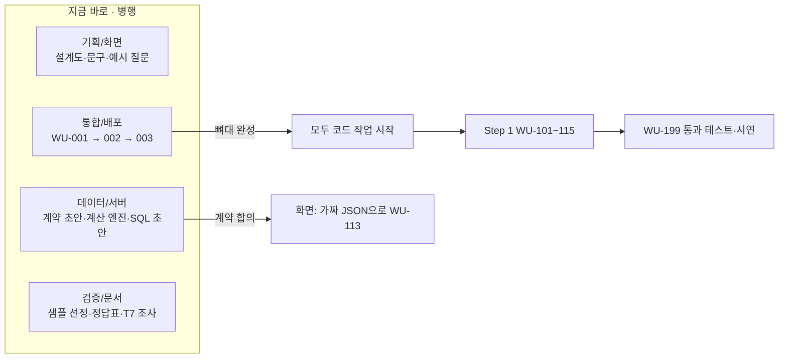

# HANDOFF — 팀 업무분장과 작업 착수 안내

| 항목 | 내용 |
|---|---|
| 프로젝트 | project_sleepyheads — 질문형 기업 분석 서비스 (공시 숫자 + 뉴스 단서) |
| 작성자 | Sung, Hyun-Joon · Lee, Yelim · ByeongJun Min |
| 작성일 | 2026-09-28 |
| 기준 문서 | [PRD](DevelopDoc/PRD.md) v0.6 · [TECH_SPEC](DevelopDoc/TECH_SPEC.md) v0.6.1 · [API_SPEC](DevelopDoc/API_SPEC.md) v0.3.1 · [WORK_UNITS](DevelopDoc/WORK_UNITS.md) v0.3.4 · [FINAL_CHECKLIST](DevelopDoc/FINAL_CHECKLIST.md) v0.3 |

### 변경 이력
| 날짜 | 내용 |
|---|---|
| 2026-09-28 | 최초 작성 (역할 4개, 첫 작업, 계약, 키 관리, 협업 규칙) |
| 2026-09-28 | 백엔드 구성(Supabase + Vercel) 확정, **API_SPEC 추가**에 따라 역할별 첫 작업·계약·환경변수·첫 주 목표 갱신 |
| 2026-09-29 | **서비스 범위 밖 질문 정중한 거절**(AI 오남용 방지) 추가에 따라 기획/화면 문구·데이터/서버 판정·검증/문서 회귀 질문 작업 갱신, FINAL_CHECKLIST 작성 완료 |
| 2026-09-29 | WU-001 완료, 서버 API 뼈대 반영(API_SPEC v0.2.2), Next.js 16 `proxy.ts` 이름 반영 |
| 2026-09-29 | WU-112 완료·WU-113 화면(가짜 데이터 기준) 완료, **뉴스 출처 Google 뉴스 RSS로 교체**(네이버 키 불필요), **분석 글을 투자 인사이트(투자 포인트)로 전환**, 주가 API 주소 V2 반영 |
| 2026-09-29 | **§0 이어서 시작하기 추가** (하루 마감 기준 진행 현황·결정·다음 할 일), 서버 작업 WU-101~107(PR #7·#8) main 반영, 외부 키 4개 시험 호출 성공, 배포 주소 동작 확인, 담당자 이름 기입, `pnpm check:keys` 추가 |
| 2026-09-29 | 서버 오류(`INTERNAL_ERROR`) 안내 화면 추가 — "잠시 후 다시 시도" + 요청 ID 표시 (§0.3 6번 앞부분 완료), 가짜 모드 "서버 오류" 추가 |
| 2026-09-29 | WU-108 구글 로그인 코드 연결 (§0.3 3번, PR #9·#10 합침 — 서버 쪽은 병준님 구현 기준, 열린 주소 이동 보안 수정 포함), 서버 작업은 WU-110 진행 중 |
| 2026-09-29 | WU-109~111 서버 파이프라인(예림님 PR #11) main 반영 — 검토 수정 포함 (§0.3 2번, §0.4) |
| 2026-09-29 | **§0 저녁 마감 기준으로 갱신**: PR #9~#13 반영, 운영 로그인 실패 원인(Vercel `NEXT_PUBLIC_SUPABASE_URL` 값 오류) 기록, 다음 할 일 재정렬 |

> 이 문서 하나만 읽으면 **내 역할, 지금 바로 할 일, 다른 역할과 맞춰야 할 약속**을 알 수 있게 썼다. 자세한 내용은 기준 문서 4개를 따른다.

---

## 0. 이어서 시작하기 (2026-09-29 저녁 마감 기준)

> 새 세션·새 팀원은 **이 절부터** 읽는다. 여기 적힌 상태가 가장 최신이다.

### 0.1 오늘 main에 들어간 것
| PR | 내용 | 작성 |
|---|---|---|
| #2 | WU-001 앱 뼈대 (Next.js 16·TypeScript·Tailwind, 계약 타입, 테스트·CI) | 현준 |
| #4 | WU-112 공통 레이아웃·약관·로그인/동의 화면, WU-113 대기화면·결과 화면(좌 차트/우 분석 글)·상태별 안내, **가짜 모드** | 현준 |
| #5 | 서버 API 23개 경로 뼈대 + 공통 처리 `route()`(권한·약관·요청 속도·멱등키·오류 형식) | 병준 |
| #6 | 뉴스 출처 **Google 뉴스 RSS**로 교체, 분석 글 **투자 포인트** 전환, 주가 API V2 반영 (문서 6개 + 화면) | 현준 |
| #7 → #8 | **WU-101~107 서버 작업**(DB 스키마·RLS·DB 함수, 외부 호출기, 기업 목록·검색, 재무 수집, 계산 엔진, 공시 분류) + main과 충돌 해결, 뉴스 출처 맞춤 마이그레이션 | 예림 (충돌 해결: 현준) |
| #9 | WU-108 구글 로그인 코드 1차 + WU-113 서버 오류 안내(요청 ID) | 현준 |
| #10 → #12 | **WU-108 구글 로그인**(콜백·로그아웃·`/api/me`·약관 동의 API·`src/proxy.ts`) — #9와 같은 작업이라 서버 쪽은 병준님 구현으로 통일, **탭 문자를 끼운 외부 주소 이동 보안 수정** | 병준 (충돌 해결: 현준) |
| #11 → #13 | **WU-109~111 질문 해석·분석 실행·설명 작성** + 검토 수정(질문 한도 초과 500→429, 연도별 "최근 N년" 진행 중인 올해 제외, 결론 길이 상한, 금지어 우회 차단 등) | 예림 (검토·수정: 현준) |

- 테스트: 단위 434개, 화면 63개 (1280px·375px). CI는 Linux·Windows 두 환경에서 돈다.
- 배포: **https://projectsleepyheads.vercel.app** — 화면은 뜨지만 **로그인이 안 된다** (원인 §0.3 0번). 로그인·실제 질문은 아직 운영에서 한 번도 성공하지 못했다.
- 합치는 방식: 포크 PR이 main과 충돌하면 `merge/pr-<번호>-…` 브랜치에서 그 PR 커밋을 그대로 합치고 충돌만 풀어 새 PR로 올린다 → 합쳐지면 원래 PR도 자동으로 Merged 표시 (#8·#12·#13).

### 0.2 오늘 결정한 것 (문서 반영 완료)
| 결정 | 내용 | 근거 |
|---|---|---|
| 뉴스 출처 | 네이버 검색 API → **Google 뉴스 RSS** (키 없음, `after:`/`before:`로 기간 지정) | PRD D10, TECH §3.3 — 네이버는 신규 신청 중단·검색 결과 AI 활용 금지 |
| 분석 글 | 숫자 해설 → **투자 포인트**(긍정 요인·위험 요인·확인할 점 2~4개). **스마트폰 한 화면**: 결론 + 투자 포인트 320자 이내. 추론은 숫자·뉴스 근거 연결 필수, 뉴스 없이 원인 단정 금지, 매수·매도·보유 의견·목표주가·주가 예상 금지 | PRD F-V6·F-V11~13·D11, TECH §11.3·§11.5, 계약 `Explanation.insights`·`EXPLANATION_LIMITS` |
| 주가 API 주소 | `…/1160100/GetStockSecuritiesInfoService_V2/getStockPriceInfo_V2`, 상장주식수 `lstgStCnt` 있음 | TECH §3.2, T5 |
| 가짜 모드 | `.env.local`에 `NEXT_PUBLIC_API_MOCK=1`이면 화면이 `tests/fixtures/mock/` 가짜 데이터로 동작. **운영 배포에서는 넣어도 꺼짐**, 켜지면 화면 맨 위에 안내 줄 | API_SPEC §8.3, `src/lib/api-client/mode.ts` |
| 합치는 방식 | 팀원은 **포크에서 PR** → main에 Merge (협업자 초대는 하지 않음). 포크 PR의 CI는 저장소 주인이 PR의 Files changed → **Awaiting approval → Approve workflows to run**을 눌러야 돈다 | 2026-09-29 현준 결정 |
| Next.js 16 | `middleware.ts` → **`proxy.ts`** | TECH §18.1 |

### 0.3 역할별 다음 할 일 (우선순위 순)
**MVP(Step 1 핵심 통과 테스트: "삼성전자의 최근 5년 매출액 추이를 보여줘" → 실제 데이터로 좌 차트·우 분석 글)에 필요한 코드는 모두 main에 들어갔다. 막는 것은 운영 설정(0번)뿐이다.**

| 순서 | 담당 | 할 일 | 비고 |
|---|---|---|---|
| **0** | 통합/배포 (Vercel 접근 가능한 사람) | **Vercel 환경변수 `NEXT_PUBLIC_SUPABASE_URL`을 `https://yaonpdxrlsigdnqfdujf.supabase.co`로 고친 뒤 재배포**. 지금 값은 Supabase *대시보드 화면 주소*(`https://supabase.com/dashboard/project/yaonpdxrlsigdnqfdujf`)로 보여, 로그인 버튼이 Supabase 404 화면으로 간다 (2026-09-29 확인). 같은 화면에서 `NEXT_PUBLIC_SUPABASE_PUBLISHABLE_KEY`(`sb_publishable_…`)·`SUPABASE_SECRET_KEY`(`sb_secret_…`)도 Supabase → Settings → API Keys 값과 같은지 확인. Production·Preview 둘 다 | Vercel 프로젝트 → **Settings → Environment Variables** → 변수 오른쪽 **⋯ → Edit**. `NEXT_PUBLIC_` 값은 빌드 때 박히므로 **저장 후 재배포해야 반영**된다 |
| 1 | 검증/문서 (현준) | 0번 뒤 운영에서 **구글 로그인 → 약관 동의 → 대기화면**, 이어서 **Step 1 핵심 통과 테스트 질문** 실행 | WU-108·WU-199. 실패하면 화면의 요청 ID로 Vercel 로그 확인 |
| 2 | 데이터/서버 | WU-109~111 🟨 마무리: 회귀 10문항·실제 OpenAI 응답 검증·입력 토큰 측정, §0.4 "PR #11 검토 남은 것" 4개, `profiles` RLS 보안 수정 | 마이그레이션 `20260929070000`~`110000`은 Supabase에 적용됨 |
| 3 | 통합/배포 | WU-114 질문 수 한도(`/api/me/usage`, `X-Questions-Remaining`) — 지금은 화면 오른쪽 위 "남은 질문"이 안 보인다 | 한도 차감 자체는 `/api/ask`가 이미 한다 |
| 4 | 통합/배포 | WU-003 마무리 (Supabase 프로젝트 dev/prod 분리 여부 결정, Supabase GitHub 연결이 main 머지 때 마이그레이션을 자동 적용하는지) → WORK_UNITS 상태 갱신 | 지금은 로컬·Preview·운영이 **같은 DB** |
| 5 | 기획/화면 (현준) | 1번 성공 뒤 실제 서버 응답으로 WU-113 화면 재확인 → WU-115 비로그인 예시 | 로컬에서 실제 연결로 보려면 `.env.local`의 `NEXT_PUBLIC_API_MOCK`을 비운다 |
| 6 | 검증/문서 | T7(Google 뉴스 RSS 이용 조건·**AI 입력 가능 여부**), T6(12월 외 결산 샘플), 손 계산 정답표 | WU-304 전 필수 |

### 0.4 남은 확인·주의
- **PR #11 검토 남은 것 (데이터/서버)**: ① 연도별(`groupBy=year`)일 때 증감률(YoY·QoQ)이 안내 없이 빠진다 (`series-builders.ts`) ② 원인 추정 검사가 AI가 `inferred:true`를 붙일 때만 돈다 — `false`로 "때문에"를 쓰면 통과 (`build-explanation.ts`) ③ YoY 기준 지표 주석(매출 우선)과 코드(영업이익 우선)가 다르다 ④ 연도별 부채비율에 금융업 ※ 표시가 빠진다. 통합 PR에서 고친 것: 질문 한도 초과가 500 → 429, 빈 프로젝트 생성, 연도별 "최근 N년"이 진행 중인 올해 포함, 결론 길이 상한, "계산 불가"가 문장에 들어감, 금지어 띄어쓰기 우회, 전각 숫자, 배지·※ 중복, % 소수점.
- PR #11 마이그레이션 4개(`20260929080000`~`110000`)는 예림님이 이미 Supabase(`sleepyhead`, 유일한 프로젝트)에 적용했다.
- 로컬 `.env.local`: Supabase 키 3개 채움(2026-09-29, `pnpm check:keys` 6개 모두 ✅). Supabase Redirect URL 4개 등록: `http://localhost:3000/**`, `https://projectsleepyheads.vercel.app/**`, `https://*-project-agent2.vercel.app/**`, `https://*-williamus91.vercel.app/**`.
- 앞으로 로그인하면 **실제 서비스 DB에 회원이 생긴다** (DB가 하나뿐이라 로컬 시험도 마찬가지).
- **Supabase 프로젝트는 실제로 `sleepyhead` 하나**(병준님 조직 "Benji chat bot")다. §2.1의 dev/prod 두 개 분리는 아직 안 됐다 — 로컬·Preview·운영이 같은 DB를 쓴다. 분리 여부는 통합/배포가 결정.
- **[보안] `profiles_update_own` RLS 정책이 모든 컬럼 수정을 허용**한다 (`supabase/migrations/20260929020000_rls_policies.sql:14`) — 로그인한 사용자가 Data API로 자기 `agreed_terms_at`·`email`을 직접 바꿀 수 있다. 데이터/서버가 마이그레이션으로 고칠 것 (PR #10 병준님 지적). 고칠 때 A4(`/api/me/terms`)가 지금 회원 세션으로 `agreed_terms_at`을 쓰므로 **A4를 관리자 클라이언트로 바꾸는 것과 함께** 해야 한다.
- `/privacy`의 연락처 `admin@sleepyheads.com`은 **임시** — `sleepyheads.com`은 다른 곳이 쓰는 도메인이라 메일이 팀에 오지 않는다. 공개 전 팀이 받을 수 있는 주소로 교체.
- `TEAM_AGREEMENT.md`(저장소 밖에서 관리)는 아직 "계산 결과를 **설명하는** 분석 글" 표현 — 투자 인사이트 방향으로 맞출지 결정 필요.
- WU-113은 🟨: "내 분석 목록에서 거절 질문 `답변 불가` 표시"는 목록 화면(WU-201, Step 2)이 생기면, 나머지는 **실제 서버 응답으로 재확인** 필요.
- `gpt-6-luna`가 투자 포인트(추론)를 잘 쓰는지 품질 확인 필요 (T4). 부족하면 설명 작성만 `gpt-6-sol`로 올리는 안 — 현준님 결정.
- 공공데이터포털 키는 계정당 하나지만 **API마다 활용신청**해야 한다 (기업기본정보·주식시세정보 둘 다 승인됨).

### 0.5 GitHub 계정 (PR·커밋 작성자 구분용)
| 계정 | 사람 |
|---|---|
| `wilstein91`, `DriftKing86` | 성현준 (둘 다 본인) |
| `borigunbbang` | 데이터/서버 (PR #1·#3·#7 작성) |
| `Benji5526` | 통합/배포 (PR #5 작성) |

---

## 1. 지금 상태 (2026-09-29)

| 구분 | 상태 |
|---|---|
| 기획 문서 | ✅ PRD v0.6, TECH_SPEC v0.6, WORK_UNITS v0.3 작성 완료 |
| **서버 API 명세** | ✅ **API_SPEC v0.3.1** — 엔드포인트 23개, 계약 타입, Supabase·Vercel 설정까지 확정 |
| 서비스 범위 정책 | ✅ 주식·상장 주식회사 경영사항 밖의 질문, 투자 권유 요청, AI 조작 시도는 **정해진 문구로 공손히 거절** (PRD §6.3.1, TECH §4.11) |
| 백엔드 구성 | ✅ **Supabase(DB·로그인) + Vercel(서버 API·예약 실행·배포)**로 확정 |
| 코드 | 🟨 WU-001 ✅, WU-101~107 ✅, WU-112 ✅, WU-108·WU-109~111·WU-113 🟨 (코드는 main에, 운영 확인 남음), 남은 Step 1: WU-114~115, WU-199 (§0.3) |
| 외부 서비스 계정·키 | ✅ OpenDART·OpenAI·주가(금융위 V2)·뉴스(Google RSS, 키 없음) 시험 호출 성공 (`pnpm check:keys`). Supabase 키는 통합/배포 담당 |
| 배포 주소 | 🟨 https://projectsleepyheads.vercel.app (main 머지 시 자동 배포) — 로그인 안 됨, Vercel 환경변수 수정 필요 (§0.3 0번) |
| README.md | ⬜ 비어 있음 (WU-506에서 작성) |
| FINAL_CHECKLIST.md | ✅ v0.3 작성 완료 (점검은 개발 막바지에 검증/문서 담당이 진행) |

### 서비스 한 줄 요약
빈 대기화면에 **종목+질문**을 입력하면, OpenDART 재무·공시 데이터를 **필요한 최소 기간만** 불러와 서버가 계산하고, **왼쪽에 근거 차트 / 오른쪽에 AI 분석 글**(숫자가 뜻하는 바를 해석한 투자 포인트를 스마트폰 한 화면 분량으로, Google 뉴스 RSS 기사 링크를 단서로 포함)을 보여준다. 수업 워크플로우 Step 1~5 순서로 만든다. 비상업 수업용, 유료는 OpenAI GPT API 하나.

### 꼭 먼저 읽을 곳 (역할 공통, 약 30분)
1. [PRD §1~3, §12](DevelopDoc/PRD.md) — 무엇을 만드는지, Step별 범위
2. [TECH_SPEC §0, §1, §4](DevelopDoc/TECH_SPEC.md) — 원칙, 구성도, 분석 처리 흐름
3. [API_SPEC §0, §3](DevelopDoc/API_SPEC.md) — 백엔드 구성도, 엔드포인트 목록 (기획/화면·데이터/서버는 **§2 계약 타입**까지)
4. [WORK_UNITS §1](DevelopDoc/WORK_UNITS.md) — 진행 현황표와 작업 순서도
5. 이 문서의 내 역할 부분 (§3)

---

## 2. 역할 한눈에 보기

| 역할 | 한 줄 책임 | 담당자 | 소유 문서 | 소유 폴더 (작업 후 생성) |
|---|---|---|---|---|
| **기획/화면** | 사용자가 보는 모든 화면과 문구 | 성현준 (PM 겸임) | PRD, API_SPEC §2(공동) | `src/app/**/page.tsx`, `src/components/` |
| **데이터/서버** | 데이터 수집·계산·AI 호출 등 서비스의 두뇌 | 이예림 | TECH_SPEC §3~11, §15, API_SPEC §2(공동)·§7.3 | `src/lib/`, `supabase/migrations/`, `supabase/seed/` |
| **통합/배포** | 뼈대·로그인·한도·API 연결·배포 등 서비스의 뼈와 혈관 | 민병준 | TECH_SPEC §2, §13~14, §16~18, **API_SPEC** | `src/app/api/`, `src/app/auth/`, `src/proxy.ts`, `vercel.json`, `.github/`, 설정 파일 |
| **검증/문서** | "정말 맞게 동작하는가"의 증거와 문서 관리 | 성현준·민병준·이예림 공동 | WORK_UNITS 진행표, FINAL_CHECKLIST, README | `tests/regression/`, `tests/accuracy/`, `tests/perf/`, `DevelopDoc/`, `README.md` |

- 단위 테스트(`tests/unit/`)는 **그 코드를 만든 사람**이 함께 작성한다.
- 공통 약속 폴더 `src/contracts/`는 **데이터/서버 + 기획/화면이 공동 소유**한다 (§5).

### 2.1 백엔드 구성 요약 (자세히: [API_SPEC §0, §7, §8](DevelopDoc/API_SPEC.md))
| 구성 요소 | 무엇을 하나 | 담당 |
|---|---|---|
| **Vercel — 서버 API** | Next.js Route Handlers(`src/app/api/**/route.ts`). 외부 API·계산·AI 호출은 모두 여기서만 | 통합/배포(경로·권한·한도) + 데이터/서버(내부 로직 `src/lib/`) |
| **Vercel — 예약 실행(Cron)** | 매일 1회 기업 목록 동기화, 비로그인 예시 갱신 (무료 플랜은 하루 1회까지, 1시간 오차) | 통합/배포 |
| **Vercel — 배포** | `main` → 운영, PR → Preview 주소 자동 생성 | 통합/배포 |
| **Supabase — Auth** | 구글 로그인만, 이메일·비밀번호 가입 끔 | 통합/배포 |
| **Supabase — Postgres** | 모든 데이터, RLS, 한도 차감 등 DB 함수 5개 | 데이터/서버 |
| **Supabase 프로젝트 2개** | `sleepyheads-dev`(로컬·Preview), `sleepyheads-prod`(운영) | 통합/배포 |

- **브라우저는 Supabase DB를 직접 조회하지 않는다.** 로그인·로그아웃만 브라우저에서 Supabase를 쓰고, 나머지 데이터는 모두 `/api/*`를 거친다.

---

## 3. 역할별 업무

> 표의 WU 번호는 [WORK_UNITS](DevelopDoc/WORK_UNITS.md)의 작업 단위. **주** = 책임지고 완료조건을 채우는 사람, **협** = 함께 하는 사람.

### 3.1 기획/화면

**맡는 일**: 화면 설계와 구현, 화면 문구(고지문·비상업 안내·약관·처리방침·예시 질문·오류 안내·용어 설명), PRD 관리.

| Step | 주 담당 WU | 협업 WU |
|---|---|---|
| 1 | WU-112 공통 레이아웃·하단 안내·약관, WU-113 대기화면·결과 화면(좌 차트/우 분석 글), WU-115 비로그인 예시 | WU-108(로그인 화면), WU-114(남은 질문 수 표시), WU-199(시연) |
| 2 | — | WU-201(프로젝트 화면·내 분석 목록), WU-202(재실행 버튼·새 버전 표시), WU-203(전처리 진단 카드), WU-204(탈퇴 확인 창) |
| 3 | WU-305 뉴스 단서 화면 | WU-301(계획 카드), WU-302(진행 상태·취소 버튼·실행 기록), WU-303(비교표 `※` 주석·비교 그래프) |
| 4 | WU-402 차트 규격 완성·표 보기·용어 설명 | WU-401(필터 화면·설명 다시 쓰기 버튼) |
| 5 | — | WU-506(README 화면 캡처), WU-599(사용자 테스트 과제 설계) |

**진행 상황 (2026-09-29)**: 아래 2~5번은 완료 — 문구(하단 안내·약관·처리방침·거절 카드·오류 안내 14종), 예시 질문 6개(`src/components/ask/examples.ts`), 가짜 결과 데이터(`tests/fixtures/mock/`), WU-112 ✅·WU-113 화면. 다음 할 일은 §0.3.

**지금 바로 시작할 일 (코드 없이 가능)**
1. **화면 설계도(와이어프레임)** 5장: ① 빈 대기화면 ② 결과 화면(좌/우, 1280px·375px) ③ 분석 계획 카드·진행 상태 ④ 전처리 진단 카드 ⑤ 비로그인 화면. 기준: [TECH_SPEC §12.2](DevelopDoc/TECH_SPEC.md) 배치도.
2. **화면 문구 초안**: 투자 유의 고지·비상업 안내·출처(PRD §9 문구 기반), 이용약관, 개인정보 처리방침(수집 항목·목적·보관 기간·파기), 오류·되묻기 안내 문구(TECH §16 오류 코드별), **서비스 범위 밖 거절 안내 카드 문구**(PRD §6.3.1 기본안을 다듬되 뜻 유지 — 공손한 존댓말, 사과·가능한 범위·추천 질문).
3. **예시 질문 6개 이상** (PRD §6.2의 질문 유형별 1개 이상) — 대기화면 칩과 비로그인 예시에 사용.
4. **결과 객체 계약은 이미 [API_SPEC §2.5~2.6](DevelopDoc/API_SPEC.md)에 초안이 있다.** 검토해 고칠 점을 데이터/서버와 합의하고, [API_SPEC Q2 응답 예시](DevelopDoc/API_SPEC.md)를 본뜬 **가짜 결과 JSON**(`tests/fixtures/mock/`)으로 WU-113 화면을 먼저 만든다 (서버 완성을 기다리지 않음).
5. 화면별로 어떤 API를 어떤 순서로 부르는지는 [API_SPEC §6 화면 호출 흐름](DevelopDoc/API_SPEC.md)과 §4 각 엔드포인트의 "화면이 할 일" 표를 따른다.

**완료 판단**: 각 WU의 완료조건 + 화면 캡처(데스크톱 1280px, 휴대폰 375px)를 PR에 첨부.

---

### 3.2 데이터/서버

**맡는 일**: DB 스키마, 외부 API(OpenDART·주가·Google 뉴스 RSS) 수집, 계산 엔진, 질문 해석·분석 실행기·설명 작성(AI), 전처리, 뉴스 수집, 재무+주가 결합.

| Step | 주 담당 WU | 협업 WU |
|---|---|---|
| 1 | WU-101 DB 스키마·RLS·시드, WU-102 외부 API 호출기, WU-103 기업 목록·기업 찾기, WU-104 기업개황·섹터, WU-105 재무제표 수집, WU-106 계산 엔진, WU-107 공시 분류, WU-109 **서비스 범위 판정**·질문 해석·검사·기간 결정, WU-110 분석 실행기, WU-111 설명 작성 | WU-114(한도 DB 함수), WU-199 |
| 2 | WU-202 데이터 버전·재실행, WU-203 전처리 진단 | WU-201(저장 구조), WU-204(RLS 이중 차단) |
| 3 | WU-301 복합 질문 판별·계획, WU-302 단계 실행·취소·실행 기록·상한, WU-303 경쟁사·섹터 비교·금융업, WU-304 뉴스 검색·본문 요지 | WU-305 |
| 4 | WU-401 분석 보드·필터 재계산 | WU-403(DB 안 SQL 집계) |
| 5 | WU-502 재무+주가 결합 | WU-501(단계 잠금), WU-503, WU-504 |

**지금 바로 시작할 일**
1. **계약 타입 검토**: [API_SPEC §2](DevelopDoc/API_SPEC.md)의 타입이 계산 엔진·실행기 결과로 실제로 만들 수 있는 모양인지 확인하고, 서버 쪽 **Zod 스키마**와 AI 내부 형식(TECH §4.2, snake_case) → API 형식(camelCase) 변환 함수를 설계 → 기획/화면과 합의.
2. **계산 엔진 순수 함수**(WU-106) 먼저 작성: TECH §6.2~6.4는 외부 API 없이 가상 입력으로 개발·테스트할 수 있다. 3월 결산 달력 환산 예시(TECH §6.3 표)를 첫 테스트로.
3. **DB 스키마 SQL 초안**(WU-101): TECH §15 테이블 + [API_SPEC §7.3 DB 함수 5개](DevelopDoc/API_SPEC.md) + §7.4 RLS를 마이그레이션 파일로. 적용은 WU-003(`sleepyheads-dev` 생성) 후.
4. 개발용 OpenDART 키를 **본인 이름으로 발급**(§6.2)해 SK하이닉스·삼성전자·KB금융 응답 샘플을 받아 둔다.

**지켜야 할 원칙 (TECH §0)**: 숫자는 서버가 계산, AI는 숫자를 직접 쓰지 않음(자리표시자), 허용 도구만 실행, 원본 응답·기사 본문 저장 금지, 모든 외부 호출은 공통 래퍼 경유.

---

### 3.3 통합/배포

**맡는 일**: 프로젝트 뼈대, 외부 서비스 계정·키·환경변수 관리, 구글 로그인, 사용 한도, 서버 API 연결(화면 ↔ 서버), 소유자 검사, 작업 큐 보강, CI(자동 검사), 배포와 Step별 시연 환경, 보안 점검.

| Step | 주 담당 WU | 협업 WU |
|---|---|---|
| 0 | **WU-001 뼈대·개발 환경**, **WU-002 API 키 발급**(현준님과), **WU-003 Supabase·Vercel·첫 배포** | — |
| 1 | WU-108 구글 로그인·약관 동의, WU-114 질문 수 한도 | WU-113·115(API 연결), WU-199(배포·시연 환경) |
| 2 | WU-201 프로젝트 저장·API, WU-204 소유자 검사·탈퇴 | WU-299 |
| 3 | — | WU-301·302(API 연결·단계 호출), WU-399 |
| 4 | — | WU-401(API), WU-499 |
| 5 | WU-501 작업 큐 보강, WU-505 배포 전 보안·운영 점검 | WU-599(최종 배포) |

**지금 바로 시작할 일**
1. **WU-001을 가장 먼저** 끝낸다. 다른 역할의 코드 작업이 이것을 기다린다. 목표: `pnpm dev`가 되는 뼈대 + `src/contracts/`에 [API_SPEC §2](DevelopDoc/API_SPEC.md) 타입 옮기기 + `vercel.json`(§8.1 crons) + CI.
2. 현준님과 **WU-002·WU-003** 진행: 운영용 계정·키는 현준님 명의(또는 팀 공용)로 만들고, 운영 키는 Vercel 환경변수에만 넣는다.
3. **Supabase 프로젝트 2개**를 만든다: `sleepyheads-dev`(로컬·Preview), `sleepyheads-prod`(운영·시연). 무료 플랜의 활성 프로젝트 한도가 2개라 딱 맞다.
4. **Vercel 환경변수를 환경별로 등록**: [API_SPEC §8.3 표](DevelopDoc/API_SPEC.md) 그대로. Preview에는 절대 prod DB를 연결하지 않는다. `CRON_SECRET`은 16자 이상 무작위 문자열.
5. **API 뼈대 만들기**: [API_SPEC §3](DevelopDoc/API_SPEC.md)의 23개 경로에 빈 Route Handler를 만들고, 공통 처리(세션 검증·약관 확인·소유자 검사·오류 형식 §1.7·요청 속도 §1.6·`Idempotency-Key`)를 미들웨어·헬퍼로 먼저 구현한다. 내부 로직은 데이터/서버가 채운다.
6. `.env.example`과 §6의 키 배포 방식을 팀에 공지한다.

**지켜야 할 원칙**: 서버 전용 키에 `NEXT_PUBLIC_` 금지, `.env*` 커밋 금지, 모든 서비스 무료 플랜 유지(결제 수단 등록 금지, OpenAI 제외).

---

### 3.4 검증/문서

**맡는 일**: 정답 데이터와 테스트(정확도·회귀·성능·프롬프트 주입), Step별 수업 통과 테스트 주관, 문서 최신화(진행 현황표·변경 이력), FINAL_CHECKLIST·README 작성, 외부 약관 조사, 사용자 테스트 운영.

| Step | 주 담당 WU | 협업 WU |
|---|---|---|
| 1 | **WU-199 Step 1 통과 테스트·시연** | WU-102(샘플 기업 선정), WU-106(손 계산 정답), WU-109(질문→분석 요청 기대표) |
| 2 | **WU-299** | WU-203(결측·중복 샘플과 기대값) |
| 3 | **WU-399** | WU-304(약관·robots.txt 조사 T7) |
| 4 | WU-403 대용량 성능 측정, **WU-499** | — |
| 5 | WU-503 회귀 테스트 세트, WU-504 프롬프트 주입 검증, WU-506 README·운영 문서, **WU-599** | WU-505 |

**지금 바로 시작할 일 (코드 없이 가능)**
1. **샘플 기업 선정** (TECH T6): 12월 결산 대형주(SK하이닉스·삼성전자), 금융사 2곳(예: KB금융 + 1곳), **12월 외 결산 상장사 2곳**, 별도재무제표만 있는 기업 1곳 → 목록과 선정 이유를 기록.
2. **손 계산 정답표**: 샘플 기업의 최근 4개 분기 매출·영업이익·순이익을 DART 원문에서 직접 옮겨 적고, 4분기 단독·달력 환산·YoY를 손으로 계산 → `tests/accuracy/` (WU-106, WU-199에 쓰임).
3. **Google 뉴스 RSS 이용 조건 조사** (TECH T7·T8): 비상업 이용 조건, 결과를 AI 입력에 써도 되는지, 주요 언론사 robots.txt, RSS 링크를 원문 주소로 풀 수 있는지 → 요약 보고. 이 결과로 뉴스 본문 확인 방식이 확정된다. (네이버 검색 API는 신규 신청 중단·AI 활용 금지로 제외, PRD D10)
4. **회귀 질문 초안 10개 이상** (WU-503 필수 유형 포함 — **범위 밖·투자 권유·조작 시도·섞인 질문·기업 없는 주식 질문** 포함). FINAL_CHECKLIST.md는 v0.2까지 작성되어 있으니 점검 방법을 숙지한다.

**완료 판단 권한**: 각 Step 마지막 WU(`WU-x99`)의 완료 체크는 검증/문서 담당이 한다.

---

## 4. 작업 순서와 병행 가능 구간



- **첫 병목은 WU-001(뼈대)**: 통합/배포 담당이 최우선으로 끝낸다.
- **두 번째 병목은 결과 객체 계약**: 합의되면 화면과 서버가 서로 기다리지 않고 동시에 진행한다.
- Step 1 안에서 서버 쪽 순서: 101 → 102 → 103 → 104 → (105 → 106) / 107 → 109 → 110 → 111. 화면(112·113)과 로그인(108)은 병행.

---

## 5. 역할 간 약속 (계약)

여러 사람이 동시에 일하려면 **주고받는 데이터 모양**을 먼저 정해야 한다. 모든 약속은 **[API_SPEC.md](DevelopDoc/API_SPEC.md)에 초안이 확정**되어 있고, 코드로는 `src/contracts/`에 TypeScript 타입으로 둔다. **바꿀 때는 API_SPEC을 먼저 고치고, PR에 관련 역할 모두의 확인이 필요하다** (API_SPEC §9).

| 약속 | 내용 | 만드는 쪽 | 쓰는 쪽 | 기준 |
|---|---|---|---|---|
| 분석 요청 (화면용) | 서버가 해석·검사한 질문 (`AnalysisRequestView`) | 데이터/서버 | 기획/화면 | API_SPEC §2.2 (AI 내부 형식은 TECH §4.2) |
| **결과 객체** | 차트·표 데이터, 숫자 ID(`f1`…), 단위, 기준 보고서, 분석 기준 바, 사용된 데이터 | 데이터/서버 | **기획/화면** | **API_SPEC §2.5** |
| 분석 글 형식 | 결론·근거·뉴스 단서·주의사항 | 데이터/서버 | 기획/화면 | API_SPEC §2.6 |
| 분석 상태 | `needs_clarification / awaiting_approval / awaiting_preprocess / queued / running / succeeded / partial / failed / canceled` | 데이터/서버 | 기획/화면, 통합/배포 | API_SPEC §2.3, §5 |
| 서버 API | 경로·권한·요청·응답·오류 코드·요청 속도 | 통합/배포 | 기획/화면 | API_SPEC §1, §3, §4 |
| DB 스키마·DB 함수 | 테이블·컬럼·RLS·RPC 5개 | 데이터/서버 | 통합/배포 | TECH §15, API_SPEC §7.3~7.4 |

- 계약이 정해지기 전에는 **가짜 데이터(`tests/fixtures/mock/`)**로 각자 개발한다.

---

## 6. 개발 환경과 키 관리

### 6.1 준비물 (각자)
| 도구 | 용도 | 확인 방법 |
|---|---|---|
| Git + GitHub 계정 | 코드 관리 | `git --version` |
| GitHub SSH 키 등록 | 저장소 받기·올리기 | `ssh -T git@github.com` 에서 본인 계정 이름이 나오면 성공 |
| 저장소 협업자 초대 수락 | 쓰기 권한 | 초대 메일 수락 후 저장소에 푸시 가능 |
| Node.js LTS | 앱 실행 | `node -v` (정확한 버전은 WU-001에서 `.nvmrc`로 고정) |
| pnpm | 패키지 관리 | `pnpm -v` |
| Supabase CLI | DB 마이그레이션 (데이터/서버·통합/배포만) | `supabase --version` |

### 6.2 키 관리 규칙
| 키 | 개발용 (로컬) | 운영용 (배포) | 관리자 |
|---|---|---|---|
| OpenDART | **각자 본인 명의로 무료 발급** (개인별 일일 한도를 따로 쓰기 위함) | 팀 운영 키 | 통합/배포 |
| 공공데이터포털 주가 | 각자 발급 | 팀 운영 키 | 통합/배포 |
| 뉴스 (Google 뉴스 RSS) | 키 없음 | 키 없음 | — |
| OpenAI (유료) | **팀 키 1개 공유** (월 예산 상한 설정 필수) | 같은 키 또는 운영 전용 키 | 현준님 |
| Supabase | `sleepyheads-dev` 프로젝트 키 | `sleepyheads-prod` 프로젝트 키 | 통합/배포 |
| `CRON_SECRET` | 임의 값 | 운영 값 (Vercel Production에만) | 통합/배포 |

- 환경별 전체 목록(로컬·Preview·Production)은 [API_SPEC §8.3](DevelopDoc/API_SPEC.md).

- 키는 **각자 `.env.local`에만** 둔다. 채팅방·이슈·PR·커밋에 절대 붙여넣지 않는다.
- 공유가 필요한 키(OpenAI, Supabase dev)는 **비밀번호 관리자나 1회용 비밀 메시지**로 전달한다.
- 키가 한 번이라도 노출되면 즉시 관리자에게 알리고 **재발급**한다.
- OpenAI 사용량은 팀 전체가 같은 예산을 쓴다. 개발 중 반복 테스트는 **AI 응답을 고정한 가짜 응답**으로 돌린다 (TECH §20, WU-503).

### 6.3 저장소 받기
```bash
git clone git@github.com:wilstein91/project_sleepyheads.git
```
- `pnpm install` → `.env.example`을 `.env.local`로 복사해 키 입력 → `pnpm dev` → `http://localhost:3000`
- pnpm이 없으면 먼저 `npm install -g pnpm`. 화면 테스트를 처음 돌릴 때는 `pnpm exec playwright install chromium`.
- **키 점검**: `pnpm check:keys` — 키마다 실제로 한 번 불러 ✅/❌만 보여준다 (키 값은 출력하지 않음).
- **서버 없이 화면 보기**: `.env.local`에 `NEXT_PUBLIC_API_MOCK=1`. 질문에 "날씨"(범위 밖 거절), "사도 돼"(투자 권유 거절), "반도체 회사"(되묻기), "2013년"(기간 밖), "직원 만족도"(지원 불가), "AI 장애", "DART 장애", "설명 실패", "서버 오류"(요청 ID 안내)를 넣으면 해당 화면이 나온다 (`src/lib/api-client/mock-analysis.ts`).
- 검사 한 번에: `pnpm lint && pnpm format:check && pnpm typecheck && pnpm test && pnpm test:e2e`

---

## 7. 협업 규칙

### 7.1 브랜치·커밋·PR
| 항목 | 규칙 |
|---|---|
| 기본 브랜치 | `main` — 항상 배포 가능한 상태. 직접 푸시하지 않고 PR로만 합친다 |
| 작업 브랜치 | `<종류>/WU-<번호>-<짧은설명>` 예: `feat/WU-105-financials`, `docs/WU-506-readme`, `fix/WU-113-mobile-layout` |
| 커밋 메시지 | `WU-105: 재무제표 수집 CFS/OFS 처리` 처럼 WU 번호로 시작 |
| PR 제목 | `[WU-105] 재무제표 수집` |
| PR 본문 | ① 무엇을 했나 ② **완료조건 체크리스트 복사 + 체크 결과** ③ 화면이면 캡처 ④ 계약(§5) 변경 여부 |
| 리뷰 | 최소 1명 승인. 계약 변경 PR은 관련 역할 모두 승인 |
| 자동 검사 | CI(검사·테스트)가 통과해야 합칠 수 있다 |
| 합친 뒤 | 작업자가 WORK_UNITS 진행 현황표의 상태를 갱신 (⬜ → 🟨 → ✅) |

### 7.2 완료의 정의
하나의 WU는 다음을 모두 만족해야 ✅:
1. WORK_UNITS의 해당 WU **완료조건이 전부 체크**
2. 단위 테스트 포함, CI 통과
3. PR 리뷰 승인 후 `main`에 합침
4. 화면 변경이면 1280px·375px 캡처 첨부

### 7.3 문서 변경
- 기능 범위가 바뀌면 **PRD 먼저** (기획/화면), 구현 방식이 바뀌면 **TECH_SPEC** (데이터/서버·통합/배포), 작업이 바뀌면 **WORK_UNITS** (검증/문서) 순서로 고친다.
- 문서마다 맨 위 **변경 이력**에 한 줄 추가하고 버전을 올린다.

### 7.4 막혔을 때
- 다른 역할의 작업을 기다려야 하면 가짜 데이터로 먼저 진행하고, PR 본문에 "대기 중인 WU"를 적는다.
- 외부 서비스 화면(가입·설정 메뉴)은 자주 바뀌므로, 안내받은 메뉴가 없으면 추측하지 말고 공식 문서를 확인한다.

---

## 8. 아직 정해지지 않은 것 (TECH_SPEC §21)

| # | 항목 | 담당 | 언제 |
|---|---|---|---|
| T1 | OpenDART 일일 한도 정확한 값 | 통합/배포 | WU-002 |
| T3 | Vercel 무료 플랜 실행 시간·CPU 안에 드는지 | 통합/배포 | WU-110 이후 측정 |
| T4 | `gpt-6-luna` 품질 (모델 상향은 현준님 결정) | 검증/문서 | WU-109, WU-503 |
| T5 | ~~주가 API 필드(상장주식수 여부)~~ ✅ `lstgStCnt` 실제 응답으로 확인 (2026-09-29). 보통주 구분은 남음 | 데이터/서버 | WU-502 |
| T6 | 12월 외 결산 샘플 기업 | 검증/문서 | **지금 바로** |
| T7 | Google 뉴스 RSS 이용 조건(AI 입력 가능 여부)·언론사 robots.txt | 검증/문서 | **지금 바로** (WU-304 전 필수) |
| T8 | RSS 링크(Google 경유)를 원문 주소로 풀 수 있는지, 본문 추출·RSS 호출의 Vercel 동작 | 데이터/서버 | WU-304 |

---

## 9. 첫 주 목표

| 역할 | 첫 주에 끝낼 것 |
|---|---|
| 기획/화면 | 화면 설계도 5장, 문구 초안, 예시 질문, API_SPEC §2 계약 검토·합의, 가짜 JSON으로 대기화면·결과 화면 초안 |
| 데이터/서버 | 계약 검토·Zod 스키마, 계산 엔진 순수 함수 + 달력 환산 테스트, DB 스키마·DB 함수·RLS SQL, 샘플 응답 수집 |
| 통합/배포 | WU-001·002·003 완료 (배포 주소에서 빈 페이지 확인), Supabase 2개·Vercel 환경변수·Cron 설정, API 23개 경로 뼈대와 공통 처리, 키 배포 방식 공지 |
| 검증/문서 | 샘플 기업 목록, 손 계산 정답표 1차, T7 조사 보고, 회귀 질문 초안, FINAL_CHECKLIST 초안 |
